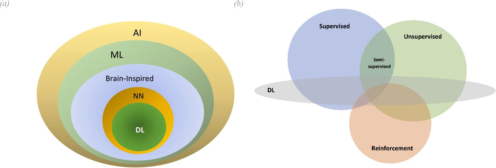

# AI and Machine Learning Overview
**Machine Learning (ML):** A way of achieving AI, where the machine learns from data to make predictions or decisions without being explicitly programmed.

Machine learning is a subfield of artificial intelligence (AI).

Source: [Augmenting organizational decision-making with deep learning algorithms: Principles, promises, and challenges](https://www.sciencedirect.com/science/article/pii/S0148296320306512)

**Types of Machine Learning:**
- Supervised Learning
- Unsupervised Learning
- Semi-Supervised Learning
- Self-supervised Learning
- Reinforcement Learning (RL)
- Transfer Learning

## Supervised Learning
Supervised learning is a type of machine learning where the model is trained on a labeled dataset. This means that the input data is paired with the correct output. The model learns (optimizes) to make predictions based on the input data by comparing its predictions with the correct output during the training process.

**Labeled data**: Data that has pairs of both the input data $X$ and the "correct" output $Y$. These $X$ and $Y$ mappings are used to train the model.

$Input(X) \rightarrow Output(Y)$

Supervised learning is when we provide our learning algorithm with examples (labeled data), where each example includes the correct answer $Y$ to learn from.

The model is trained on this labeled data to make predictions on new, unseen data. During the training process, the model optimizes itself by comparing its predictions with the correct output.

| Input (X) | Output (Y) | Application |
| --- | --- | --- |
| House features (e.g., size, location) | Price | House price prediction |
| Image | Label (e.g., cat, dog) | Image classification |
| Email | Spam or not spam | Email spam detection |
| Text | Sentiment (e.g., positive, negative) | Sentiment analysis |
| Audio | Transcription | Speech recognition |
| Stock prices | Future price | Stock price prediction |

### Example tasks:
- [Regression](regression.md): Predicting a number (continuous value) such as house prices, stock prices, etc.
- [Classification](classification.md) : Predicting discrete classes or categories from a limited set of possible values, such as cat or dog, or numeric labels like 0, 1, 2, etc. (e.g., spam vs. non-spam emails, speech recognition, or cat vs. dog in an image).

> Regression models predict a number from infinitely many possible values, while classification models predict a category from a finite set of categories (or classes).

### Main supervised learning algorithms:
- [Regression](regression.md): Predict a number.
- [Classification](classification.md): Predict a category.
- [K-Nearest Neighbors (KNN)](knn.md)
- [Decision Forests, Random Forests, and Gradient Boosted Decision Trees](decision_forests.md)
- Neural Networks (when used with labeled data)

## Unsupervised Learning
Unsupervised learning is a type of machine learning where the model is trained on an **unlabeled** dataset. This means the model learns to make predictions based on the input data without being explicitly told what the correct output is. The model learns to identify patterns and structures in the data.

Unlike the supervised learnign where the training data comes with both $input(X)$ and $output(Y)$, in unsupervised learning, the data comes with only $input(X)$. The model learns to find structures in the data without being explicitly told what to look for.

### Main unsupervised learning algorithms:
- [Clustering](clustering.md): Grouping similar data points together, into clusters. e.g. Google News which groups similar news articles together. This happens without any supervision or labeled data. The algorithm learns to group similar data points together based on their features. Another example is customer segmentation in marketing.
- **Anomaly detection:** Identifying rare items, events, or observations that raise suspicions by differing significantly from the majority of the data. e.g. fraud detection.
- **Dimensionality reduction:** Compress data using fewer numbers.

## Semi-Supervised Learning
This is a hybrid of supervised and unsupervised learning, where the model is trained on a small amount of labeled data and a large amount of unlabeled data. Semi-supervised learning is useful when labeling data is expensive or time-consuming, but there is a large amount of unlabeled data available.

Example tasks:
- Image classification with limited labeled images.
- Text categorization with few labeled documents and many unlabeled ones.

## Self-supervised Learning
Self-supervised learning is a specific form of unsupervised learning where the model generates its own supervisory signals from the data itself. This is a common approach in modern neural networks, particularly in natural language processing (NLP) and computer vision.

Example tasks:
- Word embeddings (e.g., models like Word2Vec or BERT) where relationships between words are learned from large corpora.
- Learning image representations by predicting missing parts of images or predicting future frames in a video.

## Transfer Learning
Though not a traditional type of learning, transfer learning refers to using a pre-trained model on one task and adapting it to a different but related task. This is especially useful when there is not enough labeled data for the new task, but the knowledge gained from a different domain can be reused.

Example tasks:
- Using a model trained on ImageNet to classify medical images with a smaller labeled dataset.
- Fine-tuning a language model like GPT for specific text classification tasks.

## Neural Networks
**Neural Networks (NNs)** are a type of machine learning where interconnected nodes (or "neurons") are layered to create an **artificial neural network**. This can be shallow (with one hidden layer) or deep (with multiple hidden layers). This [Neural Network Overview](/nn_overview.md) covers the basics.

Neural networks and deep learning can be used for all types of learning: supervised learning (e.g., image recognition, speech recognition, and language translation), unsupervised learning (e.g., clustering, dimensionality reduction, generative models), reinforcement learning (e.g., game playing and robotics), and semi-supervised learning.

**Deep neural networks**: These networks have more than two layers of nodes between the input and output layers, unlike shallow networks that have at most one layer between inputs and outputs.

Deep learning is a subfield of machine learning that employs algorithms inspired by the structure and function of the brain's neural networks. While it is correct to say that deep learning involves the use of neural networks, it specifically refers to networks with multiple layers.

On the other hand, there are algorithms with a simplified structure, typically having one or no hidden layers, called _shallow networks_. Examples of shallow learning methods include Linear Regression, Logistic Regression, Perceptron, Radial Basis Function Network (RBFN), and Single-Layer Autoencoder.

> [Shallow Learning](https://www.sciencedirect.com/science/article/pii/S2666165921000041) refers to the majority of machine learning models proposed prior to 2006, including shallow neural networks (neural networks with only one or no hidden layers).

### Deep Learning
Deep learning is based on **deep** neural networks. As discussed, not all neural networks are used for deep learning. The neural networks used in deep learning are **deep** neural networks, which have multiple layers of neurons. These include:

- **Multilayer Perceptrons (MLPs):** The simplest form of a neural network with multiple layers.
- **Convolutional Neural Networks (CNNs):** Designed to process grid-like data such as images, applying convolutional layers that pre-process data for the layers that follow.
- **Recurrent Neural Networks (RNNs):** Designed to work with sequence data, with neurons that have feedback connections, effectively forming a memory over the sequence.
- **Transformer Networks:** Designed to work with sequence data, but unlike RNNs, they allow for parallel computation and can directly attend to any point in the sequence.

While other machine learning algorithms can create models with multiple layers (like decision trees and support vector machines), the term "deep learning" is almost exclusively used to refer to techniques involving deep neural networks.

## Math for AI/ML
Although you don't need to be a math expert to work in the field of AI/ML, a solid understanding of the underlying math concepts is essential. The followings are the key concepts you should be familiar with:

**College Calculus and Linear Algebra**: You should be comfortable with (multivariable) derivatives and understand matrix/vector notation and operations.

**Probability Theory**: You should be familiar with basic probability distributions (e.g., continuous, Gaussian, Bernoulli) and be able to define concepts for both continuous and discrete random variables, including expectation, independence, probability distribution functions, and cumulative distribution functions.

## Resources
- [AI/ML Resources](aiml_resources.md)
- [Machine Learning Workflow and Process](aiml_overview_workflow.md).
- [Glossary](glossary.md)
