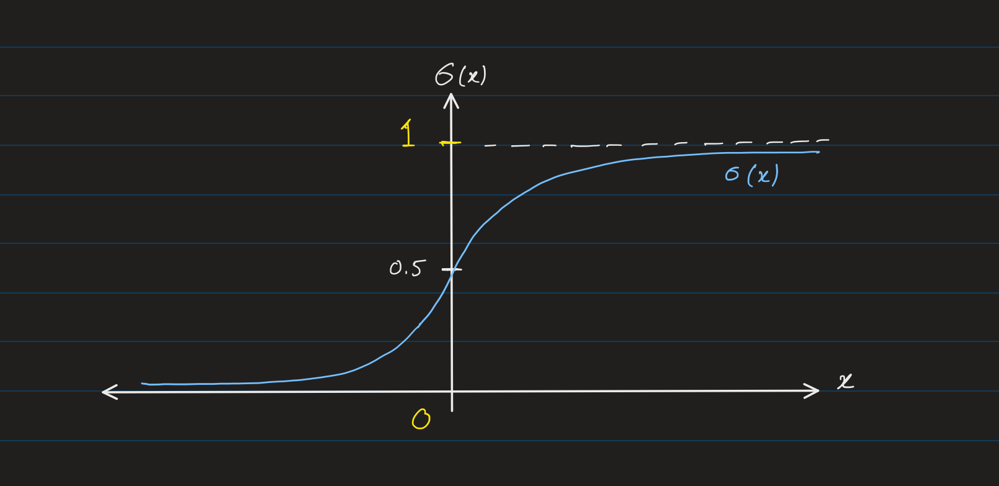
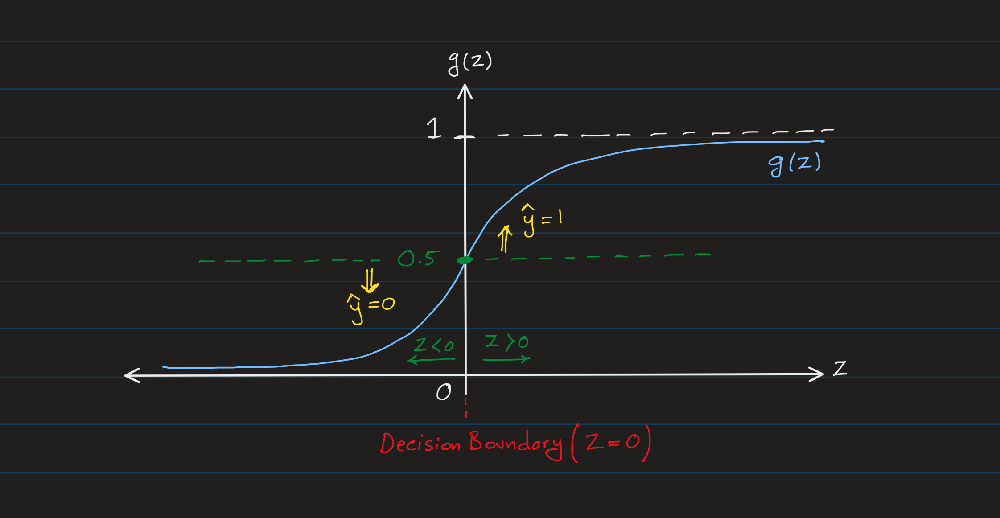
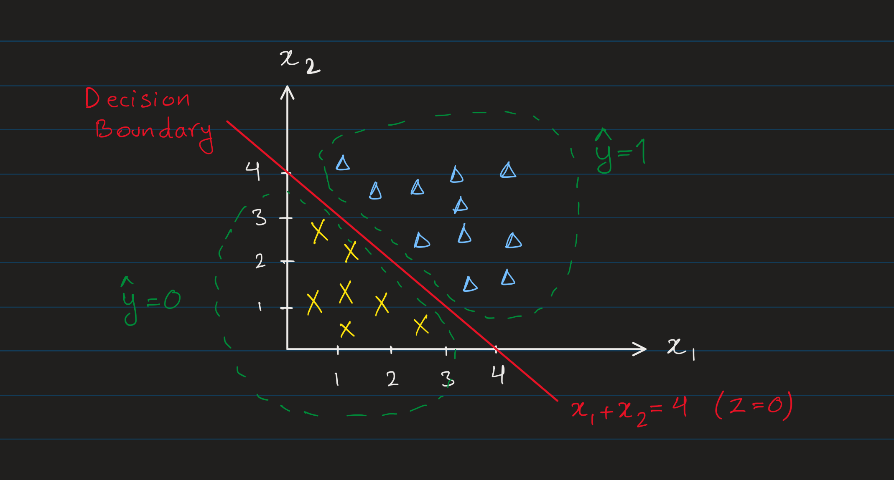
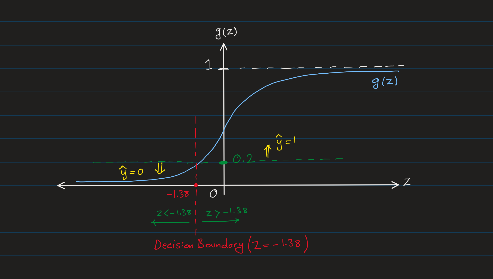
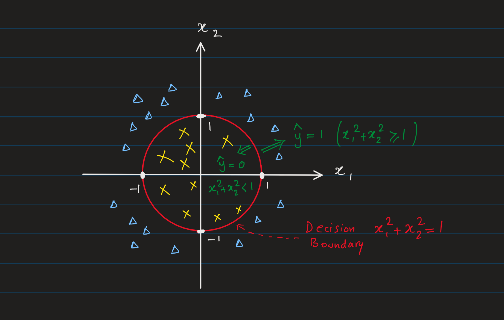

# Classification

Classification is a type of supervised learning where the target variable is group of categories or classes.

> The terms **Class** and **Category** are used interchangeably in classification.

The example of classification problems are:

| Question | Target Variable |
| --- | --- |
| Is this email spam or not? | Yes or No |
| Is this tumor malignant? | Yes or No |
| Is this transaction fraudulent? | Yes or No |

**Binary Classification** 
This is a type of classification where the target variable has only two classes.
- Yes or No
- True or False
- Positive or Negative
- 1 or 0

**Multi-class Classification** 
This is a type of classification where the target variable has more than two classes.

| Question | Target Variable |
| --- | --- |
| What type of tumor is this? | Malignant, Benign, Normal |
| What type of animal is this? | Cat, Dog, Bird |
| What type of vehicle is this? | Car, Truck, Bus, Motorcycle, Bicycle |

## Logistic Regression

Logistic regression is one of the most popular algorithms for binary classification. It predicts the probability of an input belonging to a class, and classifies it based on a threshold value.

**Why not using Linear Regression algorithm for classification?**

As it turns out, linear regression is not a suitable algorithm for classification problems.

- **Continuous Output**: Linear regression predicts continuous values, often outside [0, 1], making it unsuitable for classification probability outputs.

- **Unreliable Decision Boundary**: Minimizing squared error doesn't ensure effective class separation, leading to poor performance in classifying overlapping or imbalanced data.

- **Inapplicability to Multi-class**: Linear regression cannot naturally handle multiple discrete classes, making it infeasible for multi-class classification problems.

> The term _regression_ in logistic regression is a misnomer and is because of historicl reasons. Logistic regression is a classification algorithm not a regression algorithm.

For classification we'll algorithms which can emphasize the class separation, and predict probabilities of discrete class membership. For example in binary classification, **sigmoid** function maps continues inpute values to probabilities between 0 and 1. This makes it suitable for binary classification (we will see multi-class classification later). While the sigmoid function is continuous, its output emphasizes values near 0 and 1, and its derivative is computationally simple, aiding calculating gradients during training (the gradient descent algorithm).

### Sigmoid Function
Sigmoid function (also called logistic function) is a mathematical function which maps any real value to a value between 0 and 1. It is defined as:

$$
\sigma(x) = \frac{1}{1 + e^{-x}}
$$

where:
- $e$ (Euler's number) is the base of the natural logarithm, which is approximately equal to 2.71828.
- $x$ is the input to the function.

The above S-shape of sigmoid function also called the **sigmoid curve**.

> [Good video on Euler's number $e$](https://www.youtube.com/watch?v=m2MIpDrF7Es)

Output of Sigmoid function is always between 0 and 1.

$$ 0 < \sigma(x) < 1 $$

As we can see, the result of large positive values of $x$ approaches 1, and the result of large negative values of $x$ approaches 0.

For example:

$$\sigma(100) = \frac{1}{1 + e^{-100}}= \frac{1}{1 + e^{\frac{1}{100}}} = \frac{1}{1 + \text{very small number}}  \approx 1$$

Similarly:

$$\sigma(-100) = \frac{1}{1 + e^{100}}= \frac{1}= \frac{1}{1 + \text{very large number}}  \approx 0$$

In specific case of $x=0$, the sigmoid function returns 0.5.

$$\sigma(0) = \frac{1}{1 + e^{0}} = \frac{1}{1 + 1} = 0.5$$

### Logistic Regression Model
Now let's bring this back to the context of classification.

Recall that the linear regression model defined as:
$$f_{\vec{\mathbf{w}},b}(\vec{\mathbf{x}}) = \vec{\mathbf{w}} \cdot \vec{\mathbf{x}} + b$$

Let's assume $z=\vec{\mathbf{w}} \cdot \vec{\mathbf{x}} + b$, and we call the sigmoid function $g$ (instead of $\sigma$) in this context.

$$g(z) = \frac{1}{1 + e^{-z}}$$
$$z = \vec{\mathbf{w}} \cdot \vec{\mathbf{x}} + b$$

So the logistic regression model can be defined as:
$$g(z) = g(\vec{\mathbf{w}} \cdot \vec{\mathbf{x}} + b) = \frac{1}{1 + e^{-(\vec{\mathbf{w}} \cdot \vec{\mathbf{x}} + b)}}$$

So, overall it can be written as:

$$f_{\vec{\mathbf{w}},b}(\vec{\mathbf{x}}) = g(\vec{\mathbf{w}} \cdot \vec{\mathbf{x}} + b) = \frac{1}{1 + e^{-(\vec{\mathbf{w}} \cdot \vec{\mathbf{x}} + b)}}$$

### Interpretation of Logistic Regression Output
The output of logistic regression model is a **probability** value between 0 and 1. In other words, the output shows the probability that class is $1$ or $0$.

In the math terms, the output of logistic regression model is:
$$f_{\vec{\mathbf{w}},b}(\vec{\mathbf{x}}) = P(y=1|\vec{\mathbf{x}}) $$

Where:
- $P(y=1|\vec{\mathbf{x}})$ is the probability that the target variable $y$ is $1$ given the input $\vec{\mathbf{x}}$.

> $P(a | b)$ is the conditional probability of $a$ given $b$.

In some texts, this probability also denoted as:

$$f_{\vec{\mathbf{w}},b}(\vec{\mathbf{x}}) = g(\vec{\mathbf{w}} \cdot \vec{\mathbf{x}} + b) = P(y=1|\vec{\mathbf{x}};\vec{\mathbf{w}},b)
$$

Where:
- $\vec{\mathbf{x}};\vec{\mathbf{w}},b$ denotes that the probability is conditioned on $\vec{\mathbf{x}}$ based on the given parameters $\vec{\mathbf{w}}$ and $b$.

For example: 
If $x$ is the "email" and $y$ is the "spam" or "not spam" class.

- $x$ is the input email.
- $y=0$ means "not spam".
- $y=1$ means "spam".

And for an email the logistic regression model output is $0.7$.

$$f_{\vec{\mathbf{w}},b}(\vec{\mathbf{x}}) = P(y=1|\vec{\mathbf{x}}) = 0.7$$

This means that the probability of the email being spam is $0.7$ or in simple terms the email has $70\%$ chance of being spam.

We know that the sum of probabilities of all possible outcomes is $1$.

$$P(y=0) + P(y=1) = 1$$

So, the probability of the email being not spam is $0.3$ or $30\%$.

$$P(y=0|\vec{\mathbf{x}}) = 1 - P(y=1|\vec{\mathbf{x}}) = 1 - 0.7 = 0.3$$

### Decision Boundary
The decision boundary is the line that separates the area where y = 0 and where y = 1. It is created by our hypothesis function. This boundary line could be a straight line or a curve.

**Threshold** is the value that separates the classes. For example, in the following plot, the threshold is $g(z)=0.5$ and the decision boundary is at $z = 0$.

- If $f_{\vec{\mathbf{w}},b}(\vec{\mathbf{x}}) \geq 0.5$, then model predicts class $1$ ($\hat{y} = 1$).
- If $f_{\vec{\mathbf{w}},b}(\vec{\mathbf{x}}) < 0.5$, then model predicts class $0$ ($\hat{y} = 0$).

We can also infer that:
- $f_{\vec{\mathbf{w}},b}(\vec{\mathbf{x}}) \geq 0.5$ when $z \geq 0$.
- $f_{\vec{\mathbf{w}},b}(\vec{\mathbf{x}}) < 0.5$ when $z < 0$.

We know $z = \vec{\mathbf{w}} \cdot \vec{\mathbf{x}} + b$, so we can say:

- If $\vec{\mathbf{w}} \cdot \vec{\mathbf{x}} + b \geq 0$, then model predicts $\hat{y} = 1$.
- If $\vec{\mathbf{w}} \cdot \vec{\mathbf{x}} + b < 0$, then model predicts $\hat{y} = 0$.

And the decision boundary line is:

$$z = 0 \implies \vec{\mathbf{w}} \cdot \vec{\mathbf{x}} + b = 0$$

> Note: that the more accurate notation is by denoting the model for the $i_{th}$ training example as below:
>
> $f_{\vec{\mathbf{w}},b}(\vec{\mathbf{x}}^{(i)})=g(z^{(i)})=g(\vec{\mathbf{w}} \cdot \vec{\mathbf{x}}^{(i)} + b)$
>
> However, for brevity we'll drop the superscript $(i)$ in the following sections.

**Linear Decision Boundary** 
The decision boundary line is the line that separates the area where $\hat{y} = 0$ and $\hat{y} = 1$. This line is where we are neutral about the outcome.

In the above example, we assumed the threshold as $g(z) = 0.5$. So, the decision boundary is at $z = 0$.

Therefore:
$$f_{\vec{\mathbf{w}},b}(\vec{\mathbf{x}}) = g(z) = g(w_1x_1 + w_2x_2 + b)$$

$$\text{Decision Boundary Line: }\  z = \vec{\mathbf{w}} \cdot \vec{\mathbf{x}} + b = 0$$

$$w_1x_1 + w_2x_2 + b = 0$$

Let's say now we already trained our model well and we have the values of $w_1$, $w_2$ and $b$ as below:

$$w_1 = 1, w_2 = 1, b = -4$$

So, the decision boundary is:
$$x_1 + x_2 - 4 = 0 \implies x_2 + x_1 = 4$$

And when we draw this line on the plot, we can see that the decision boundary separates the area where $\hat{y} = 0$ and $\hat{y} = 1$.

#### Changing the Threshold

So far, we assumed the threshold as $g(z) = 0.5$. Even though this is a common choice as indicates the equal probability of 50% for each class, but depending on the problem and data we can always choose a different threshold. For example, in case of detecting deseases before reviwing by the doctor, we may want to set the threshold to a lower value to make sure we're not missing any positive cases.

The following plot, shows a lower threshold at $0.2$:

Now based on threshold $g(z) = 0.2$ we need to find out the corresponding decision boundary on $z$.

$$
g(z) = 0.2 \implies \frac{1}{1 + e^{-z}} = 0.2
$$

Rearrange and simplify:

$$
1 = 0.2(1 + e^{-z}) = 0.2 + 0.2 e^{-z}
$$

$$
0.8 = 0.2 e^{-z} \implies e^{-z} = 4
$$

Take the natural logarithm:
$$
-z = \ln(4) \implies z = -\ln(4) \approx -1.386
$$

So, for a threshold of $0.2$, the corresponding decision boundary on $z$ is $z \approx -1.386$.

This means:
- If $z \geq -1.386$, model predicts $\hat{y} = 1$.
- If $z < -1.386$, model predicts $\hat{y} = 0$.

Now the line of $z = -1.386$ will give us the decision boundary on the plot.

#### Non-linear Decision Boundary
In previous example, the decision boundary was a straight line. But in some cases, due to the nature of the data and our model, the decision boundary can be a curve.

Let's say we have the _polynomial features_ $x_1$ and $x_2$ as below:

$$f_{\vec{\mathbf{w}},b}(\vec{\mathbf{x}}) = g(z) = g(w_1x_1^2 + w_2x_2^2 + b)$$

In this case, the decision boundary is a curve. For example, in specific case of $w_1 = 1, w_2 = 1, b = -1$, the decision boundary is:

$$x_1^2 + x_2^2 - 1 = 0 \implies x_1^2 + x_2^2 = 1$$

Which is a circle with radius $1$.

It means:
- If $x_1^2 + x_2^2 \geq 1$, then model predicts $\hat{y} = 1$.
- If $x_1^2 + x_2^2 < 1$, then model predicts $\hat{y} = 0$.

> The decision boundary can be even a more complex curve in higher dimensions with higher order polynomial features.

### Cost Function for Logistic Regression
For the introduction, see [Loss and Cost Functions](loss_and_cost_functions.md).

As we discussed, the logistic regression for the $i_{th}$ training example is defined as:

$$
f_{\vec{\mathbf{w}},b}(\vec{\mathbf{x}}^{(i)}) = \frac{1}{1 + e^{-(\vec{\mathbf{w}} \cdot \vec{\mathbf{x}}^{(i)} + b)}}
$$

The loss function $L$ which is the measure of error between the predicted value and the actual for a single training example defined as:

$$L(f_{\vec{\mathbf{w}},b}(\vec{\mathbf{x}}^{(i)}), y^{(i)})$$

And the cost function $J$ which is the average of the loss function over all training examples defined as:

$$J(\vec{\mathbf{w}},b) = \frac{1}{m} \sum_{i=1}^{m} L(f_{\vec{\mathbf{w}},b}(\vec{\mathbf{x}}^{(i)}), y^{(i)})$$

For logistic regression, we use [binary cross-entropy loss](loss_and_cost_functions.md#binary-cross-entropy-loss) function.

$$\begin{aligned}
    L(f_{\vec{\mathbf{w}},b}(\vec{\mathbf{x}}^{(i)}), y^{(i)}) = \begin{cases}
        - \log\left(f_{\vec{\mathbf{w}},b}\left( \vec{\mathbf{x}}^{(i)} \right) \right) & \text{if $y^{(i)}=1$}\\
        - \log \left( 1 - f_{\vec{\mathbf{w}},b}\left( \vec{\mathbf{x}}^{(i)} \right) \right) & \text{if $y^{(i)}=0$}
    \end{cases}
\end{aligned}$$

We can combine these two cases into one formula:

$$
L(f_{\vec{\mathbf{w}},b}(\vec{\mathbf{x}}^{(i)}), y^{(i)}) = -y^{(i)} \log(f_{\vec{\mathbf{w}},b}(\vec{\mathbf{x}}^{(i)})) - (1 - y^{(i)}) \log(1 - f_{\vec{\mathbf{w}},b}(\vec{\mathbf{x}}^{(i)}))
$$

And the cost function $J$ is the average of the loss function over all training examples:

$$
J(\vec{\mathbf{w}},b) = -\frac{1}{m} \sum_{i=1}^{m} \left[ y^{(i)} \log(f_{\vec{\mathbf{w}},b}(\vec{\mathbf{x}}^{(i)})) + (1 - y^{(i)}) \log(1 - f_{\vec{\mathbf{w}},b}(\vec{\mathbf{x}}^{(i)})) \right]
$$

For more details on why and how we use cross-entropy loss function for logistic regression, see [Cross-Entropy Loss](loss_and_cost_functions.md#cross-entropy-loss).

> For Logistic Regression, we don't use use squared error loss function, to non-linear nature of the sigmoid function (our model), which results in a wiggly, non-convex loss surface with many potential local minima.

### Gradient Descent for Logistic Regression
As we discused, now that we have defined our cost function, we want to find the best possible values for our parameters $\vec{\mathbf{w}}$ and $b$ which minimize the cost function $J$. We can use the gradient descent algorithm to do this.

The definition of the gradient descent algorithm as discussed in [Gradient Descent](gradient_descent.md) is:

$$\begin{align*} \text{repeat}&\text{ until convergence: } \lbrace \newline
& w_j = w_j -  \alpha \frac{\partial J(\vec{\mathbf{w}},b)}{\partial w_j} \; & \text{for j = 0..n-1}\newline
&b\ \ = b -  \alpha \frac{\partial J(\vec{\mathbf{w}},b)}{\partial b}  \newline \rbrace
\end{align*}$$

Where:
- $\alpha$ is the learning rate.
- $n$ is the number of features and $w_j$ is the $j_{th}$ parameter of $\vec{\mathbf{w}}$.

In order to apply the gradient descent algorithm, we need to calculate the partial derivatives of the cost function $J$ with respect to the parameters $\vec{\mathbf{w}}$ and $b$.

The partial derivative of the cost function $J$ with respect to the parameter $w_j$ is:

$$\frac{\partial J(\vec{\mathbf{w}},b)}{\partial w_j} = \frac{1}{m} \sum_{i=1}^{m} \left( f_{\vec{\mathbf{w}},b}(\vec{\mathbf{x}}^{(i)}) - y^{(i)} \right) x_j^{(i)}$$

And for the parameter $b$ is:
$$\frac{\partial J(\vec{\mathbf{w}},b)}{\partial b} = \frac{1}{m} \sum_{i=1}^{m} \left( f_{\vec{\mathbf{w}},b}(\vec{\mathbf{x}}^{(i)}) - y^{(i)} \right)$$

See [Derivative of Logistic Regression Cost Function](../math/derivatives.md#derivative-of-the-logistic-regression-cost-function) for the details of this derivation.
