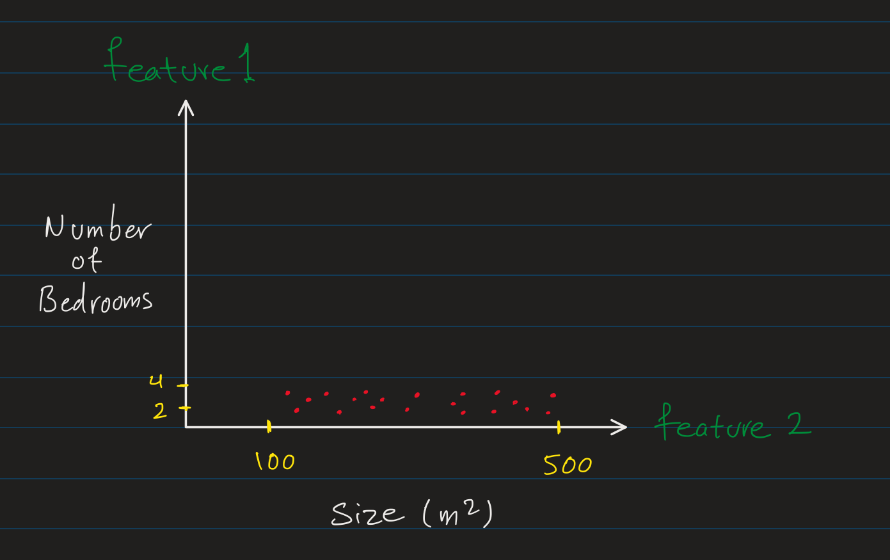
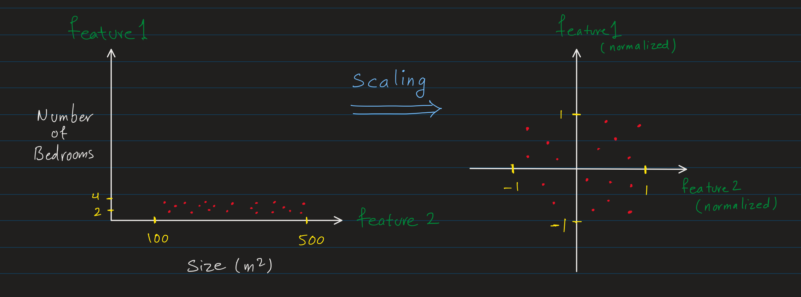

# Feature Engineering

Feature engineering is the process of transforming and selecting data representations to best capture information relevant for model training and performance. It can include creating new features, transforming existing features, and selecting the most relevant features for the model.

It's a crucial step in the machine learning workflow, as it can significantly impact the performance of the model.


Features is simple terms are the input data that we provide to the model for training and prediction. In the house price prediction example, features could be the number of bedrooms, bathrooms, square footage, etc, and the target variable would be the price.

In math term we show the features as $x_1, x_2, \dots, x_n$ or as a vector $\vec{\mathbf{x}} = [x_1, x_2, \dots, x_n]$.

For example, in a dataset of house prices with 3 features, we have vector of features $\vec{\mathbf{x}}$
- $x_1$: size
- $x_2$: number of bedrooms
- $x_3$: number of bathrooms

Which we can represent as a vector:

$$\vec{\mathbf{x}} = [x_1, x_2, x_3]$$


We show the our training set (the dataset of $m$ data points), as matrix $X$ of size $m \times n$ where each row is a data point and each column is a feature.

```math
X = \begin{bmatrix} x_1^{(1)} & x_2^{(1)} & x_3^{(1)} \\ x_1^{(2)} & x_2^{(2)} & x_3^{(2)} \\ \vdots & \vdots & \vdots \\ x_1^{(m)} & x_2^{(m)} & x_3^{(m)} \end{bmatrix}
```

Or using the vector notation:
```math
X = \begin{bmatrix} \vec{\mathbf{x}}^{(1)} \\ \vec{\mathbf{x}}^{(2)} \\ \vdots \\ \vec{\mathbf{x}}^{(m)} \end{bmatrix}
```


## Types of Features


Features can be categorized into different types based on their characteristics:

- **Nominal Variables**: Categories with no intrinsic ordering (e.g., types of houses, car brands).

- **Ordinal Variables**: Categories with a clear ordering but unknown spacing between categories (e.g., socio-economic status like low, middle, and high).

- **Binary Variables**: A nominal variable with only two categories (e.g., gender male/female, yes/no decisions).

- **Continuous Variables**: Numeric variables that can take on an infinite number of values or any value within a range (e.g., temperature, price).

- **Discrete Variables**: Numeric variables that take on a countable number of values, often integers (e.g., number of bedrooms, count of items).

- **Interval Variables**: Numeric variables with meaningful, equal intervals between values but no true zero point (e.g., dates, IQ scores).

- **Ratio Variables**: Numeric variables with both equal intervals and a meaningful zero point, allowing for the calculation of ratios (e.g., height, weight, age, income).

- **Cyclical Variables**: Numeric or ordinal variables that repeat in a cycle (e.g., hours of the day, days of the week, months of the year).


## Feature Engineering Techniques
Common techniques for feature engineering include:
- Date formatting
- Standardization
- Dimensionality Reduction
- Creating Polynomial Features
- One-Hot Encoding and other encoding techniques
- Scaling and Normalization


## Scaling and Normalization
In feature engineering, we often need to transform features to ensure they are on comparable scales, centered appropriately (e.g., around 0), and comparable across features to support the requirements of machine learning algorithms. This preprocessing is crucial because many algorithms are sensitive to the magnitude or distribution of input features.

> Feature Scaling usually comes as one of the last steps in preprocessing. After we are done with selecting the features, clean up the outliers, handling the missing values, encoding, and creating new features, then we scale the features to maintain a uniform consistency across the dataset. However, this is not an absolute rule and depends on the overall data processing pipeline and specific requirements of the features or model.


For example, in the house-price prediction example:

Training set:

| House | Size (sqm) | Bedrooms | Price ($1000s) |
|-------|------------|----------|----------------|
| 1     | 210        | 4        | 800            |
| 2     | 190        | 3        | 700            |
| 3     | 300        | 4        | 850            |
| 4     | 100        | 2        | 450            |
| 5     | 200        | 3        | 820            |
| 6     | 500        | 5        | 900            |

We can see that the range of values for each feature is different. Size is in hundreds, bedrooms are single digits, and price is in thousands. This difference in scale can affect the performance of some machine learning algorithms.

The linear regression model for house price prediction could be:

$\hat{y} = w_1 \cdot \text{Size} + w_2 \cdot \text{Bedrooms} + b$


A tiny change in the parameter $w_1$ for the size feature can have a much larger effect on the output of the model than the same change in the parameter $w_2$ for the number of bedrooms. This can lead to model bouncing back and forth during training, making it harder to converge.

Also, over sensitivty to the scale of the features can make the model less robust and more sensitive to noise in the data.

So, to avoid these issues, we scale the features to have a similar range of values.

**Scatter Plot of Features**

Scatter plots are a common and useful way to visualize the relationship between two variables (features). They can help identify patterns, trends, and relationships in the data.



As you can see the scatter plot is a plot of one feature against another. It can show the relationship between the two features, the distribution of the data, and any patterns or trends that may exist between the two features.

In this example, it shows us the the _scale discrapency_ between the features. The size feature is in hundreds, while the number of bedrooms is in single digits. Larger-scaled features (like Size) tend to dominate, potentially leading to slow training, biased or suboptimal learning.

Another issue is that without scaling which normalizes the range of values to a similar scale, the model may think that the number of bedrooms is less important than the size, which is not necessarily true. For example, the bedroom is in the range of single digits e.g. 1, 2, 3, ... while the size is in the range of hundreds e.g. 100, 200, 300, etc. Also, the relation between the bedrooms could be more significant than the sizes. For example, between 2 to 4 bedroom is a significant difference in price while between 400 to 500 sqm may not be as significant. So, we need to scale the features to have a similar range of values to avoid all these issues.

In our house price prediction example, we can see the range of values for features is different. Size is in hundreds, bedrooms are single digits. As we discussed, we want to avoid the scale discrepancy between features and **transform** them into a **similar range** of usually around **[-1, 1]** or **[0, 1]**.

Let's first rewrite our training set in a matrix form.

```math
X = \begin{bmatrix} 210 & 4 \\ 190 & 3 \\ 300 & 4 \\ 100 & 2 \\ 200 & 3 \\ 500 & 5 \end{bmatrix}
```

So, we have $m=6$ data points and $n=2$ features. We can represent the features as $x_1$ and $x_2$ or as a vector $\vec{\mathbf{x}} = [x_1, x_2]$.

For example, for the first data point, we have:

$$\vec{\mathbf{x}}^{(1)} = [210, 4]$$
$$x_1^{(1)} = 210 \quad \text{ and } \quad x_2^{(1)} = 4  \quad \text{ and } \quad y_1 = 800$$


### Min-Max Scaling

Min-Max scaling is a normalization technique that scales the data to a fixed range.


$$x_{1, \text{norm}} = \frac{x_1 - x_{1, \text{min}}}{x_{1, \text{max}} - x_{1, \text{min}}} \times (\text{max} - \text{min}) + \text{min}$$

where:
- $x_1$ is the vector of all values of the first feature across data points,

where:
- $x_1$ is the vector of all values of the first feature across data points,
- $x_{1, \text{min}}$ is the minimum value of the first feature,
- $x_{1, \text{max}}$ is the maximum value of the first feature,
- $\text{min}$ and $\text{max}$ are the minimum and maximum values of the new range (e.g., -1 and 1).

For example, if we want to scale the size feature to the range [-1, 1], we can use min-max scaling as follows:

$$x_{1, \text{norm}} = \frac{x_1 - x_{1, \text{min}}}{x_{1, \text{max}} - x_{1, \text{min}}} \times (1 - (-1)) + (-1)$$

$$x_{1, \text{norm}} = \frac{x_1 - 100}{500 - 100} \times (1 - (-1)) + (-1)$$

So, for the first data point $x_1^{(1)} = 210$:

$$x_{1, \text{norm}}^{(1)} = \frac{210 - 100}{500 - 100} \times 2 - 1 = -0.45$$

If we by _rescaling_ all the values of the first feature, we the normalized values of the first feature ($x_1$) for all data points in $X$ (scaled to the range [-1, 1]) are:

```math
x_{1, \text{norm}} = \begin{bmatrix} -0.45 \\ -0.55 \\ 0.00 \\ -1.00 \\ -0.50 \\ 1.00 \end{bmatrix}
```


Similarly, we can apply min-max scaling to the number of bedrooms feature:

Now, let's apply min-max scaling to the size feature:


$$x_{2, \text{norm}} = \frac{x_2 - x_{2, \text{min}}}{x_{2, \text{max}} - x_{2, \text{min}}} \times (1 - (-1)) + (-1)$$

$$x_{2, \text{norm}} = \frac{x_2 - 2}{5 - 2} \times 2 - 1$$

```math
x_{2, \text{norm}} = \begin{bmatrix} 0.33 \\ -0.33 \\ 0.33 \\ -1.00 \\ -0.33 \\ 1.00 \end{bmatrix}
```

The rescaled matrix $X$ with both features normalized to the range $[-1, 1]$ is:

```math
X_{\text{norm}} = \begin{bmatrix} -0.45 & 0.33 \\ -0.55 & -0.33 \\ 0 & 0.33 \\ -1 & -1 \\ -0.5 & -0.33 \\ 1 & 1 \end{bmatrix}
```

Each column represents the rescaled values for each feature in $X$ within the specified range.

The following illustration shows how scaling the features normalize the range of values to a similar scale which is important for both the training and the performance of the model.




> Scaling (Normalization) changes the geometry of the feature space, empasizing on the direction and orientation of the data points rather than their absolute values. So, two model trained with and without normalization may have different results, since the scale of the input data has changed **fundamentally**, not just proportionally.
>

**Special Case: Target Range [0, 1]**

When the desired range is $[0, 1]$, the formula simplifies to:
$$
x_{\text{norm}} = \frac{x - x_{\text{min}}}{x_{\text{max}} - x_{\text{min}}}
$$
This is the version often presented as "min-max scaling" in, but it is just a specific instance of the generalized formula.


### Mean Normalization
Mean normalization is a feature scaling technique where each feature is transformed so that its values are centered around zero. It is calculated as:

$$
x_{\text{norm}} = \frac{x - \mu}{x_{\text{max}} - x_{\text{min}}}
$$

where:
- $x$ is the original value of the feature
- $\mu$ is the mean of the feature

In our example, the mean of the size feature $x_1$ is:

$$
\mu_{x_1} = \frac{210 + 190 + 300 + 100 + 200 + 500}{6} = 250
$$

So, the mean normalized values of the size feature for the first data point $x_1^{(1)} = 210$ would be:

$$
x_{1, \text{norm}}^{(1)} = \frac{210 - 250}{500 - 100} = -0.40
$$

Similarly, the mean normalized values of the number of bedrooms feature $x_2$ would be:

$$\mu_{x_2} = \frac{4 + 3 + 4 + 2 + 3 + 5}{6} = 3.5$$

So, the mean normalized value for the first data point $x_2^{(1)} = 4$ would be:
$$
x_{2, \text{norm}}^{(1)} = \frac{4 - 3.5}{5 - 2} = 0.17
$$

This way we can calculate the mean normalized values for all data points in the training set $X$.


### Z-Score Normalization

Z-score normalization (or standardization) is another common normalization technique that scales the data to have a mean of 0 and a standard deviation of 1. In other words, it transforms the data to have a standard normal distribution around 0 with a range of [-1, 1].

The formula for Z-score normalization is:

$$
x_{\text{norm}} = \frac{x - \mu}{\sigma}
$$
where:
- $x$ is the original value of the feature
- $\mu$ is the mean of the feature
- $\sigma$ is the standard deviation of the feature

For example, the Z-score normalized values of the size feature $x_1$ for the first data point $x_1^{(1)} = 210$ would be:

$$
\mu_{x_1} = 250
$$
$$
\sigma_{x_1} = \sqrt{\frac{(210 - 250)^2 + (190 - 250)^2 + (300 - 250)^2 + (100 - 250)^2 + (200 - 250)^2 + (500 - 250)^2}{6}} = 129.90
$$

$$
x_{1, \text{norm}}^{(1)} = \frac{210 - 250}{129.90} = -0.31
$$

Similarly, the Z-score normalized values of the number of bedrooms feature $x_2$ for the first data point $x_2^{(1)} = 4$ would be:
$$
x_{2, \text{norm}}^{(1)} = \frac{4 - 3.5}{0.87} = 0.58
$$

Further reading on [Mean, Variance and Standard Deviation](../math/statistics.md#mean-variance-and-standard-deviation).

### Tips for Scaling
**Aim for [-1, 1] Range**:

The rule of thumb is to aim the range of the scaled features to be around $[-1, 1]$.

$$ -1 \leq x_{\text{norm}} \leq 1$$


**The model's output will be scaled too**

When scaling features in the training set, the same scaling parameters (e.g., mean, standard deviation) must be applied to the test set to ensure consistency. The scaler is fit on the training data and then used to transform both the training and test sets. If the target variable is scaled (e.g., in regression), the model's predictions will be in the **scaled space**, and you must inverse-transform them to the original scale for interpretability. This ensures reliable evaluations, avoids data leakage, and maintains the interpretability of results.

## Creating New Features
In some cases, we can create new features by combining or transforming existing features to capture more information or patterns in the data. This process can help improve the model's performance by providing additional information that may not be present in the original features.

In our house price prediction example, let's say we have two other features: population of the neighborhood/suburb and the number of schools in the area.


| House | Size (sqm) | Bedrooms | Population | Schools | Price ($1000s) |
|-------|------------|----------|------------|---------|----------------|
| 1     | 210        | 4        | 1000       | 2       | 800            |
| 2     | 190        | 3        | 800        | 1       | 700            |
| 3     | 300        | 4        | 1200       | 3       | 850            |
| ...   | ...        | ...      | ...        | ...     | ...            |

Now we can create a feature that represent the ratio of the population to the number of schools in the area which could be an important factor in determining the price of the house.

$$\text{Population to Schools Ratio} = \frac{\text{Population}}{\text{Schools}}$$

| House | Size (sqm) | Bedrooms | Population | Schools | Population to Schools Ratio | Price ($1000s) |
|-------|------------|----------|------------|---------|-----------------------------|----------------|
| 1     | 210        | 4        | 1000       | 2       | 500                         | 800            |
| 2     | 190        | 3        | 800        | 1       | 800                         | 700            |
| 3     | 300        | 4        | 1200       | 3       | 400                         | 850            |
| ...   | ...        | ...      | ...        | ...     | ...                         | ...            |

So, now our data set has 5 features: size, bedrooms, population, schools, and population to schools ratio.

$$
\hat{y} = f_{\vec{\mathbf{w}}, b}(\vec{\mathbf{x}}) = w_1 x_1 + w_2 x_2 + w_3 x_3 + w_4 x_4 + w_5 x_5 + b
$$

Where:
- $x_5$ is the new feature (population to schools ratio)

> Creating new features relies on domain knowledge, intuition, and experimentation to identify **meaningful** relationships or interactions between features that can enhance the model's predictive power.

Other Examples:
- **Geographical Features**: You may have coordinates (latitude, longitude) in your dataset, which can be used to create new features like distance to key locations (e.g., city center, landmark, etc) and replace this new feature with the original coordinates in the dataset.


## Feature Dimensionality
The number of features in a dataset is known as the feature dimensionality. For example the above house price prediction dataset has 5 features (size, bedrooms, population, schools, and population to schools ratio). So it has a feature dimensionality of 5.

**Curse of Dimensionality**:

As the number of features increases, the feature space becomes more sparse, and the volume of the space increases exponentially. This can lead to overfitting, increased computational complexity, increased training time and cost, and reduced model performance. Feature selection and dimensionality reduction techniques can help mitigate these issues by selecting the most relevant features or reducing the number of features while preserving the most important information.

So, sometimes after creating a meaningful new features, we drop the less important features to reduce the dimensionality of the feature space. For example, after creating the population to schools ratio feature, we may decide to drop the number of schools feature if it's less important or redundant.
