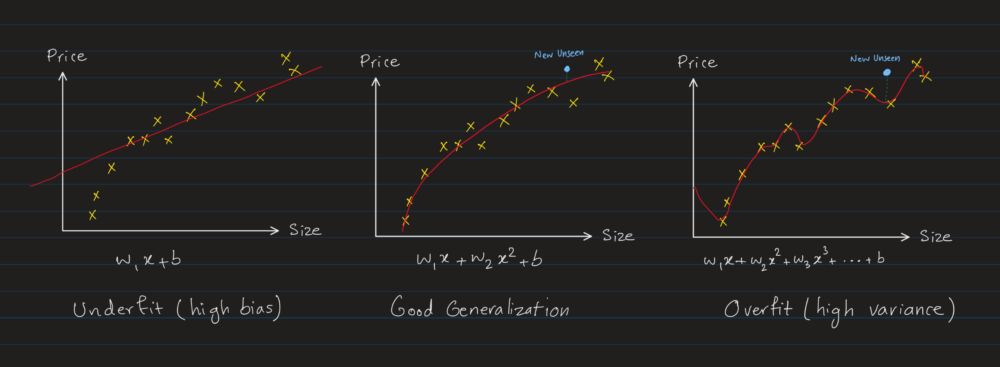
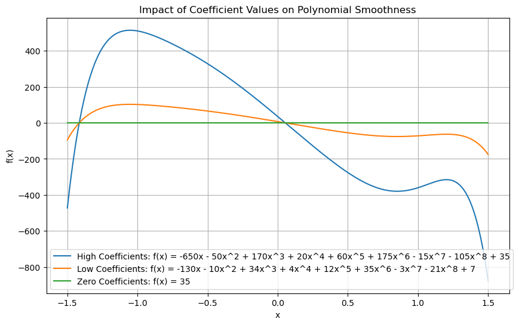

# Generalization
Generalization is the ability of a machine learning model to perform well on unseen data by capturing the underlying patterns in the training data rather than memorizing it.

Generalization is a central goal in machine learning, as the ability to generalize well is a key indicator of the model's ability to perform well in the real world. Generalization is the opposite of overfitting, which occurs when a model performs well on the training data but poorly on new data. Generalization is typically evaluated by measuring a model's performance on a held-out validation dataset, which is separate from the training data. A model that generalizes well will perform well on both the training and validation datasets, while a model that overfits will perform well on the training data but poorly on the validation data.

Generalization is a key challenge in machine learning, as it requires models to learn the underlying patterns in the data without memorizing the training examples. Techniques for improving generalization include regularization, dropout, early stopping, and data augmentation.

**Fitting** 
Fitting refers to the process of training the model (going through [gradient descent](gradient_descent.md) or other optimization algorithms) which is the process of finding the best parameters that minimize the difference between the predicted values and the actual values in the training data.

The goal of training is to find the parameters that allow the model to _generalize_ well to new, unseen data.

> Words like "fitting" and "training" are often used interchangeably in machine learning.

**Underfitting (High Bias):** 
A model is too simple to capture the underlying patterns in the data, resulting in high training and test error.

**Overfitting (High Variance):** 
A model is too complex, capturing noise and random details in the training data, leading to low training error but high test error.

**Balancing Underfitting and Overfitting:** 
The goal in machine learning is to find the sweet spot between underfitting and overfitting where the model generalizes well. This is often visualized as the **bias-variance tradeoff**, where:
- Underfitting is associated with high bias and low variance.
- Overfitting is associated with low bias and high variance.

The following image illustrates these three scenarios using example of house price prediction model based on the size of the house:

We can see int he above image:
- The underfit model (left) has high bias and it does not fit well to the training data.
- The overfit model (right) has low bias but high variance, capturing noise and random fluctuations in the training data, which means it does very well on the training data but poorly on new unseen data. The model here is too complex (too many features and high polynomial degree) and memorizes the training data *too well*. It performs very well on the training data becasue it has has captured all the noises and random fluctuations in the training data. But when it sees new unseen data, it performs poorly.
- The balanced model (center) has low bias and low variance, capturing the underlying patterns in the data without memorizing the training examples. It _generalizes_ well to new unseen data.

**Model Evaluation**: 
[Model Evaluation](model_evaluation.md) involves the methods and metrics (e.g., cross-validation, test accuracy, precision-recall) used to assess the generalization performance and ensure that the model is not overfitting or underfitting.

## Underfitting
Underfitting happens when a machine learning model is too simple to capture the underlying patterns in the data. It’s like a student who only glances at the study material and misses the key concepts, leading to poor performance on both practice tests (training data) and real exams (new data).

Underfitting occurs when a model has high bias and fails to learn the relationships between input features and target outputs in the training data. This results in both high training error and high validation/test error.

**High Bias**: 
Underfit models have high bias, meaning they have tendency to make overly simplistic assumptions about the data.

It's like having a preconceived notion that everything is straightforward, so the model oversimplifies and ignores the complexity of the patterns in the data. For example, fitting a straight line (a simple assumption) to a curved dataset shows a bias towards linearity, which leads to underfitting because the model isn't flexible enough to capture the true relationships.

A **biased model** in the context of underfitting is like a stubborn student who sticks rigidly to their initial assumptions and refuses to adapt or learn from new information, even when the data clearly shows a more complex pattern. This "stubbornness" prevents the model from capturing the true relationships in the data, leading to oversimplified predictions and poor performance.

> Words **high bias** and **underfitting** are often used interchangeably in machine learning.

**Characteristics of Underfitting:**
- Low training accuracy.
- Low test/validation accuracy.
- Indicates the model has not captured the complexity of the data.

**Example:** 
Using a simple linear regression model to fit data that has a nonlinear relationship (e.g., a quadratic pattern). A straight line won't be able to capture the curve in the data, resulting in underfitting.

**How to Address Underfitting:**
1. **Increase Model Complexity**: Use a more complex model that can better capture the data's patterns (e.g., a deeper neural network or higher-order polynomial).
2. **Improve Feature Engineering**: Add relevant features or transform existing features to better represent the data.
3. **Decrease Regularization**: Reduce overly strict regularization constraints (e.g., lower $L_1$ or $L_2$ penalties).
4. **Train Longer**: Allow the model more time to converge to the optimal solution.

## Overfitting
Overfitting happens when a machine learning model learns not just the general patterns in the training data, but also the noise or random details that don't apply to unseen data. It’s like a student memorizing answers instead of understanding the concepts, which makes them perform well on practice tests (training data) but poorly on the real exam (new data).

Overfitting occurs when a model is too complex relative to the amount and quality of the training data, resulting in excessively low training error but high validation or test error. Mathematically, it implies that the model has high variance and fails to generalize to new data.

**High Variance**: 
Overfit models have high variance, meaning they are overly sensitive to the specific data they were trained on.

A model with high variance is like an overly eager student who tries to memorize every single detail of the study material, including irrelevant or accidental errors. While this approach might lead to perfect performance on practice tests (training data), it fails when presented with new questions (test data) because the memorized specifics don't generalize.

The word _variance_ refers to the model's sensitivity to the specific data it was trained on. Imagine training the same type of model on multiple different samples of data (drawn from the same distribution). A **high-variance model** produces significantly different predictions for each sample because it tries to capture every detail, including the noise and randomness in that sample set. So, it means the model's predictions vary a lot depending on the specific data it was trained on.

> Words **high variance** and **overfitting** are often used interchangeably in machine learning.

**Characteristics of Overfitting:**
- High training accuracy.
- Low test accuracy or validation accuracy.

**Example:**
Consider fitting a polynomial to a dataset:
- A simple model (e.g., a straight line) may underfit the data, failing to capture its true complexity.
- A very complex model (e.g., a high-degree polynomial) may overfit, capturing every tiny fluctuation in the training data which performs very well on the training data but poorly on new unseen data.

**How to Address Overfitting:**
1. **Increase Training Data**: More data helps the model learn the true patterns and reduces overfitting.

2. **Feature Selection and Reduce Model Complexity**: Choose the most relevant features and reduce the model's complexity to prevent it from capturing noise.

3. **Regularization**: Add constraints like $L_1$ or $L_2$ regularization to penalize large weights.

4. **Early Stopping**: Stop training as soon as the validation error stops decreasing.

### Increase Training Data
Collecting more data is a very effective way to address overfitting, which we should try first if possible. However, collecting more data is not always feasible as we have so much data available to us, or collecting more data might be expensive or time-consuming.

With the larget training data, the model can learn to generalize better to new unseen data even with a complex model (e.g. high polynomial degree) and numerous features.

### Feature Selection and Reduce Model Complexity
There are several ways to simplify a model. One of the most common ways is to reduce the number of features. [**Feature selection**](feature_engineering.md#feature-selection) is an important technique to choose the most relevant features to train the model.

In Particular, the large number of features with a small number of training examples is a common cause of overfitting.

Sometimes even after feature selection, we still have many features that are relevant to our model and we don't want to exclude them from our training. In such cases either
we can use [**dimensionality reduction techniques**](feature_engineering.md#dimensionality-reduction) to reduce the number of features.

If after all of the above, we still have a large number of relevant features, we can either go for other techniques like [**regularization**](#regularization) or use more capable models like [**neural networks**](neural_networks.md) which can handle a large number of features as they can automatically learn important feature interactions and representations through their hidden layers

The other way to simplify the model is to reduce the model's complexity. For example, in the case of linear regression, we can reduce the polynomial degree of the model. In the case of neural networks, we can reduce the number of layers or the number of neurons in each layer.

> Remember, more complex models captures more noise and random fluctuations in the training data. They try to learn the training data too well which leads to inability to generalize well to new unseen data.

### Regularization

Let's say we have a polynomial regression model as the following:

$$f_{\vec{\mathbf{w}},b}(x) = w_0 + w_1x + w_2x^2 + w_3x^3 + \ldots + w_nx^n + b$$

The more the coefficients of $x$ in the polynomial, the more wiggly the curve will be, and as we reduce the coefficients of $x$ in the polynomial, the sharpness of the curve will be dampened down and it becomes smoother and less wiggly.

The following plot shows the difference between high, low and zero coefficients in a polynomial.

The blue curve has high coefficients:

$$ f(x) = -650x - 50x^2 + 170x^3 + 20x^4 + 60x^5 + 175x^6 - 15x^7 - 105x^8 + 35 $$

The orange curve has lower coefficients (divided by 5):

$$ f(x) = -130x - 10x^2 + 34x^3 + 4x^4 + 12x^5 + 35x^6 - 3x^7 - 21x^8 + 7 $$

The green line is when all the coefficients are zero:
$$ f(x) = 0 \times x + 0 \times x^2 + 0 \times x^3 + 0 \times x^4 + 0 \times x^5 + 0 \times x^6 + 0 \times x^7 + 0 \times x^8 + 35  = 35 $$

As we can see, if we make our coefficients too small (near zero), the curve becomes a straight line. If we make the coefficients too large, the curve becomes very wiggly with sharp turns.

So, we can get this intuition that as we decrease the coefficients of $x$ in the polynomial, the curve becomes smoother and less wiggly (going towards a straight line). If you recall, the straight line was the underfit model. So, the idea of regularization is to find the right balance between the overfitting and underfitting by controlling the coefficients of $x$ in the polynomial.

In regularization, we implement this idea by penalizing the model for having large coefficients (parameters $w_j$) to avoid overfitting (sharp turns in the curve). We want the model to have small (but not too small) coefficients to make the curve smooth which fit the data in a more balanced way.

> Regularization of bias $b$ is optional, but it has no real difference in practice.
