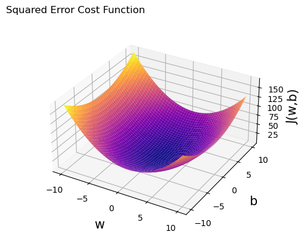
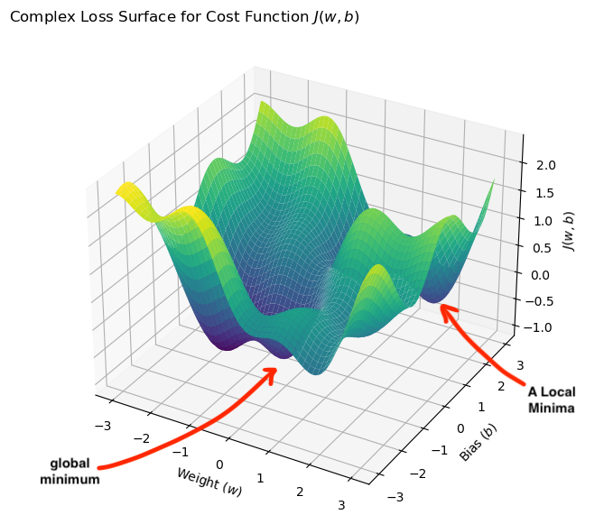
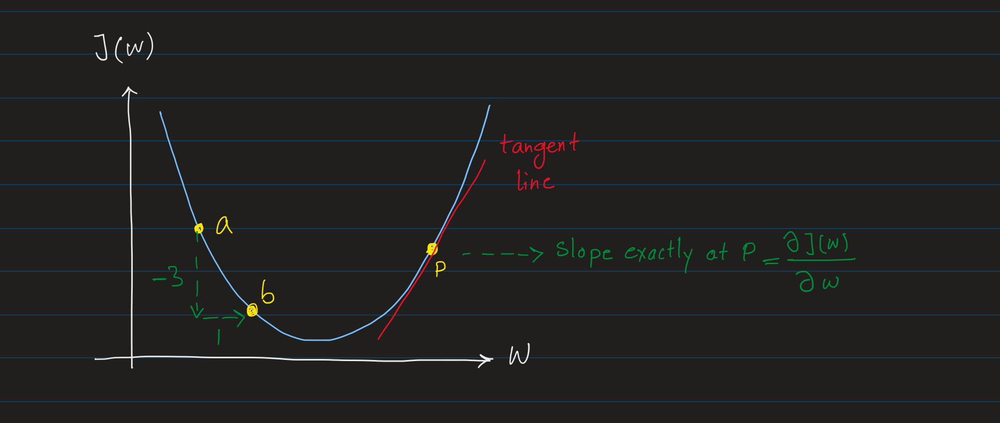
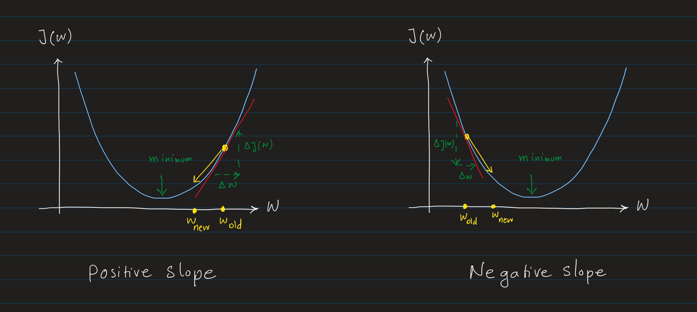
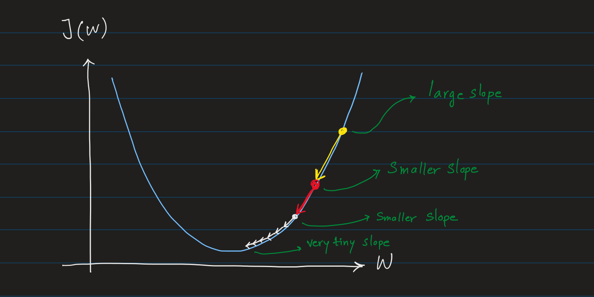
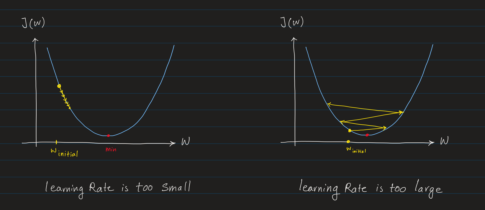
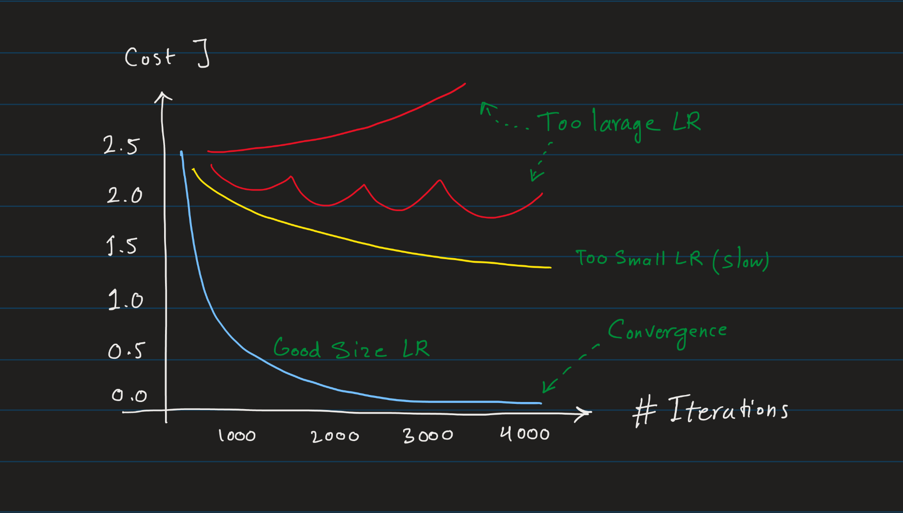

# Gradient Descent
Gradient Descent is an optimization algorithm used to minimize any function that can be expressed as a sum of differentiable functions.

> Gradient Descent is the most common algorithm used for minimizing the cost function of many machine learning models, from linear regression to the most complex neural networks. It can minimize cost functions with any number of parameters $J(w_1, w_2, ..., w_n, b)$.

The Gradient Descent algorithm start with an initial guess for the parameters, then iteratively adjust these parameters to move towards a minimum of the function.


## Loss Surface
Loss Surface is a graphical representation of a model's loss function in relation to its parameters (e.g., weights and biases). It shows how the loss changes as parameters vary, helping visualize the optimization process.

In more technical terms, the loss surface is the plot of the cost function $J(w,b)$ against the model's parameters $w_0, w_1, ...$ and $b$.

For example, in a model such as linear regression and cost function such as Mean Squared Error, the loss surface is a parabolic curve in three dimensions. This model has a single weight $w$ and bias $b$, so the loss surface is a 3D plot which x-axis is the weight $w$, y-axis is the bias $b$, and z-axis is the loss $J(w,b)$.

For example, using the Mean Squared Error loss function, which defines:

$J(w,b)=\frac{1}{2m} \sum\limits_{i = 0}^{m-1} (wx^{(i)} + b - y^{(i)})^2$




[**Convex**](https://developers.google.com/machine-learning/glossary#convex-function) surfaces such as _square error loss_ has a single global minimum, making optimization easier. **Non-convex** surfaces have multiple local minima, making optimization more challenging.

This curve represents the relationship between the weight value and the loss value. The lowest point on this curve corresponds to the weight value that minimizes the loss function, which is the goal of the training process. This point is where the gradient (derivative of the loss function with respect to the parameters) is near or at zero, indicating that the model has found the minimum of the loss function for that weight.

However, in more complex models, such as neural networks, the cost function could have a complex surface with more than one global minimum. These are called **local minima**. The lowest point in the entire function is called the **global minimum**. These surfaces are called **non-convex**. These surfaces often feature local minima, saddle points, and a global minimum, which optimization algorithms aim to find.

The cost function $J$ shown below, has a complex surface with multiple local minimas, and one global minimum.



> Note, in more complex model the loss surface may not be a simple parabolic curve, but the concept of finding the minimum of the loss function still applies.


**Intuitive Explanation of Gradient Descent:**
Imagine this surface as a terrain in a hilly area where you want to reach the lowest valley (the global minimum) as quickly as possible. You start at a random point (initial values of $w$ and $b$) and want to find the path to the lowest valley. The gradient descent algorithm helps you find the path to this lowest valley by finding the **steepest descent** at each point, and moving in that direction step by step (with a predefined **step size**).


## Gradient Descent Algorithm
Gradient Descent steps with more details:

1. **Initialize Parameters:** Start with an initial guess for the parameters $w$ and $b$.
2. **Compute the Cost Function:** Calculate the cost function $J(w,b)$ with the new values of $w$ and $b$. Also called the **forward pass**.
3. **Compute the Gradient:** Calculate the partial derivative of the cost function $J(w,b)$ with respect to the parameters $w$ and $b$. Also called the **backward pass** or [**backpropagation**](https://developers.google.com/machine-learning/glossary#backpropagation).
4. **Update the Parameters Simultaneously:** Update the weights and biases (parameters) in the opposite direction of the gradient (to descent down the hill) by a small step size $\alpha$.


5. **Repeat until Convergence:** Repeat from step 2, for multiple [Iterations](https://developers.google.com/machine-learning/glossary#iteration) until we reach a point where parameters $w$ and $b$ don't change much with each iteration, and the cost function doesn't decrease significantly. This is called **convergence**.

> An **iteration** is a complete cycle of updating the model parameters (weights and biases) based on the gradient of the cost function (step 2 to step 4).

Steps 1 and 2 are self-explanatory and have been discussed previously. So, we will focus on steps 3 onwards.

### 3. Compute the Gradient

At each step of the gradient descent algorithm, we calculate the derivative of the cost function with respect to each parameter. In other words, we calculate the rate of change of the cost function with respect to each parameter. This tells us how much the cost function will change if we change the parameters slightly in a particular direction.

The following is the **derivative** of the cost function $J(w,b)$ with respect to the parameters $w$ and $b$:

$$\frac{\partial J(w,b)}{\partial w}$$
$$\frac{\partial J(w,b)}{\partial b}$$

Intuitively, this derivative tells us in which direction we should move to descent down the hill (minimize the cost function).


**Derivative** is part of calculus that represents the rate of change of a function at a given point. To be mathematically precise, the above term is the [**partial derivative**](https://developers.google.com/machine-learning/glossary#partial-derivative) of the cost function $J(w,b)$ with respect to the parameters $w$ and $b$. The _partial_ derivative is calculating the derivative (rate of change) of the cost function with respect to a single parameter while keeping all other parameters constant.

So, for $J(w,b)$, as we have two parameters $w$ and $b$, we need to calculate two partial derivatives: $\frac{\partial J(w,b)}{\partial w}$ and $\frac{\partial J(w,b)}{\partial b}$, one for each parameter while keeping the other constant.


#### multi-dimentional surface and partial derivatives

$J$ is a function of $w$ and $b$, so it's a 3D plot of $w$, $b$, and $J$. Also the number of parameters can be more than 2, so the cost function $J$ can be a function of $n$ parameters $w_1, w_2, ..., w_n$. In that case, the cost function $J$ is a plot of $w_1, w_2, ..., w_n$, and $J$, which is a multi-dimensional surface.

However, the partial derivatives are calculated for each parameter separately while keeping all other parameters constant. For example, the partial derivative of $J$ with respect to $w_1$ is calculated while keeping $w_2, w_3, ..., w_n,b$ costant. So, the partial derivative of $J$ with respect to $w_1$ is a 2-dimensional plot of $w_1$ and $J$ while keeping all other parameters constant.

For example, the partial derivative of the cost function $J(w,b)$ with respect to the parameter $w$ is when we calculate the derivate of $J$ with respect to $w$ while keeping $b$ constant.

$$\frac{\partial J(w)}{\partial w}$$

> Derivative of a function at a point gives the _slope_ of the _tangent line_ to the function at that point. In the context of gradient descent, the derivative of the cost function tells us the slope of the cost function at a particular point in the parameter space. This slope guides us in the direction of the steepest descent (down the hill) to minimize the cost function.

#### Slope and Tangent Line
**Slope** is the ratio of the vertical change to the horizontal change between two distinct points. In other words the "_rise_ over the _run_":

$$\text{slope} = \frac{\text{rise}}{\text{run}}$$


For example in 2D plane of $x$ and $y$ coordinates, the slope of the tangent line passing through two points $(x_1, y_1)$ and $(x_2, y_2)$ is:

$$\text{slope} = \frac{y_2 - y_1}{x_2 - x_1}$$


**Partial Derivative (Instantaneous Slope)**

The **partial derivative**, gives the **instantaneous rate of change** at a single point. Instead of measuring the slope between two distinct points, the partial derivative looks at how the function changes as you make an infinitesimally small change in one variable (in your case, $w$) while holding all other variables constant.



Slope between two points of $a$ and $b$:

$$\text{slope} = \frac{\text{rise}}{\text{run}} = \frac{\Delta J(w)}{\Delta w}=\frac{-3}{1} = -3$$

Slope of $-3$ is a _negative_ slope, which means the function is decreasing as $w$ increases.

Now, to find the **exact** slope at any point like $p$, we need to draw a _tangent line_ at that point to find the slope of the function at that point.

**Tangent Line** is a straight line that touches a curve at a single point. The slope of the tangent line at that point is the derivative of the function at that point. The derivative gives the rate of change of the function at that point.

In order to find the slope at point $p$, we need to make the change in $w$ extremely small (infinitesimally small) to capture the exact rate of change at that point. This is expressed as:

$$\frac{\partial J(w)}{\partial w} = \lim_{\Delta w \to 0} \frac{\Delta J(w)}{\Delta w}$$

This limit gives us the **exact slope** at a particular point, also known as the **instantaneous rate of change** of the function $J(w)$ with respect to $w$.

The partial derivative is essentially the limit of the slope as the two points get closer and closer together, until they are infinitesimally close.


>The derivative is a more precise, continuous version of the slope, calculated as $\Delta w$ approaches an extremely small value. It maximizes the resolution (or sensitivity) of how the function $J(w)$ changes as $w$ changes. To increase this resolution, we need to make the changes in $w$ extremely small to capture the smallest impact on the function. That’s why we express this as $\lim_{\Delta w \to 0}$, where the change in $w$ becomes vanishingly small to capture the exact rate of change (with the highest resolution) at any given point.

Thus:

$$\text{slope exactly at any given point} = \frac{\partial j(w)}{\partial w}$$
"slope at any given point" means the rate of change of the function $J(w) with respect to $w$ at that point.

Further reading on [Slope and Tangent Line](../math/derivatives.md#slope-and-tangent-line).

### 4. Update the Parameters:
Once we have calculated all gradients for every parameter ($w$ and $b$), we then apply them to update the parameters **simultaneously.** This means that all weights and biases are **updated together in a single step**. This update happens only after gradients for every parameter have been computed.

We update the parameters $w$ and $b$ in the opposite direction of the gradient (to descent down the hill) by a small step size $r$ (learning rate).

$$w_{\text{new}} = w_{\text{current}} - \alpha \frac{\partial J(w,b)}{\partial w}$$
$$b_{\text{new}} = b_{\text{current}} - \alpha \frac{\partial J(w,b)}{\partial b}$$

where:
- $w_{\text{new}}$ and $b_{\text{new}}$ are the updated values of the parameters.
- $w_{\text{current}}$ and $b_{\text{current}}$ are the current values of the parameters.
- $\alpha$ is the learning rate, which controls the step size in the parameter space.

>In machine learning literature, another common notation for the above is:
>
>$$\theta_{t+1} = \theta_t - \eta \nabla_{\theta} J(\theta_t)$$
>
>Where:
>- $\theta_t$ represents the parameters (weights and biases) at step $t$ (current parameters).
>- $\theta_{t+1}$ represents the updated parameters at step $t+1$.
>- $\eta$ is the learning rate.
>- $\nabla_{\theta} J(\theta)$ is the gradient of the cost function $J$ with respect to the parameters $\theta$.

#### Moving Towards the Minimum



In the Positive Slope:

$\text{slope}= \frac{\partial J(w)}{\partial w} > 0$

$w_{\text{new}} = w_{\text{current}} - \alpha \times \text{postive number}$

$w_{\text{new}} < w_{\text{current}}$

So, when the slope is positive, the new value of $w$ is less than the current value of $w$. This means we move in the opposite direction of the slope (down the hill) to minimize the cost function.

In the Negative Slope:

$\text{slope}= \frac{\partial J(w)}{\partial w} < 0$

$w_{\text{new}} = w_{\text{current}} - \alpha \times \text{negative number}$

$w_{\text{new}} > w_{\text{current}}$

So, when the slope is negative, the new value of $w$ is greater than the current value of $w$.

In both cases, we want to find the direction which moves us towards the minimum of the cost function, which means we move in the **opposite** direction of the slope.


For further details, see this [Refresher on Positive and Negative slops](https://www.khanacademy.org/math/algebra/x2f8bb11595b61c86:linear-equations-graphs/x2f8bb11595b61c86:slope/v/positive-and-negative-slope)


#### Learning Rate
[**learning rate**](https://developers.google.com/machine-learning/crash-course/linear-regression/hyperparameters#learning_rate) and **step size** are used interchangeably in machine learning. It determines how much we move in the direction of the gradient at each iteration.

The learning rate is one of the most important _hyperparameters_ in the gradient descent algorithm. It directly affects the size of movements (descents) towards the minimum of the cost function. So, choosing the right learning rate is crucial.

$$w = w - \textcolor{red}{\alpha} \frac{\partial J(w,b)}{\partial w}$$

> Learning rate is also represented by $\eta$ (pronounced "eta") in many machine learning literature.


**Size of Slop and Learning Rate**
the steps in gradient descent are identical because the movement size depends on both factor, the gradient's magnitude (slope of the cost function at that point), and the learning rate. Assuming the learning rate is fixed, the size of the step depends on the slope (derivative) of the cost function at that point.

At ever step, we reduce $\alpha\frac{\partial J(w,b)}{\partial w}$ from the current value of $w$ to move towards the minimum of the cost function. So, considering fix $\alpha$, the larger the slope is, the larger the step size is, and the smaller the slope is, the smaller the step size is.




In the above image, we can see the larger the slope is, the larger the step size, and when we get close to the minimum, the step gets smaller as the slope gets smaller.


**Too Small or Too Large Learning Rate**



**When the learning rate is too small**: The gradient descent may work, but it will be too slow.

As we saw earlier, the slope is the key factor in the size of the step. So, these small steps get even smaller as we go down the hill (slope gets smaller).

**When the learning rate is too large**: The gradient descent may overshoot the minimum and never converge (diverge).

Again here as we can see from the image, the overshooting gets larger as we go up the hill (slope gets larger). So, instead of going down the hill towards the minimum, the gradient descent algorithm may overshoot and diverge (gets further away from the minimum).


### 5. Repeat until Convergence:

We repeat steps of backward pass, forward pass and updating the parameters (steps 2 to step 4) for number of iterations, until we reach a point (a local or global minimum) where the cost function doesn't decrease further. In other words, parameters $w$ and $b$ don't change much with each iteration, and the cost function doesn't decrease significantly. This is called [**convergence**](https://developers.google.com/machine-learning/glossary#convergence).

> Gradient descent may not always reach the global minimum, especially when the loss surface is non-convex with multiple local minima or saddle points. In such cases, the algorithm might get stuck in a local minimum. However, advanced techniques like momentum-based methods or adaptive learning rates can help improve convergence and avoid these pitfalls. We'll explore these strategies later.
>
> Thus, convergence does not guarantee that the algorithm found the global minimum; it only means the algorithm has reached a point where the gradient is close to zero (or sufficiently small). Advanced optimization techniques help mitigate these risks by increasing the chances of escaping such points.


### Gradient Descent Summary:
We can simply summarize all the steps of the Gradient Descent algorithm for $n$ parameters as follows:

$$\begin{align*} \text{repeat}&\text{ until convergence: } \lbrace \newline
& w_j = w_j -  \alpha \frac{\partial J(\vec{\mathbf{w}},b)}{\partial w_j} \; & \text{for j = 0..n-1}\newline
&b\ \ = b -  \alpha \frac{\partial J(\vec{\mathbf{w}},b)}{\partial b}  \newline \rbrace
\end{align*}$$

where:
- $n$ is the number of parameters (weights).
- $w_j$ represents the $j^{th}$ parameter (weight) of the model.
- $\vec{\mathbf{w}}$ represents all weights.
- $b$ represents the bias term.
- $\alpha$ is the learning rate.


We can also write this in a more general form for multiple parameters:
$$\begin{align*} \text{repeat}&\text{ until convergence: } \lbrace \newline
& \theta = \theta - \alpha \nabla_{\theta} J(\theta) \newline \rbrace
\end{align*}$$

where:
- $\theta$ represents all parameters (weights and biases).
- $\nabla_{\theta} J(\theta)$ is the gradient of the cost function $J$ with respect to all parameters $\theta$ (weights and biases).

> This whole process of running the Gradient Descent algorithm, is also called **training** the model. The goal of training is to find the best values of the parameters (weights and biases) that minimize the cost function $J$.

We can simply state the training (Gradient Descent) process as:
```
Many Iterations of {
    1. Forward Pass: Compute the cost
    2. Backward Pass (Backpropagation): Compute the gradient
    3. Update all parameters simultaneously, to reduce the cost.
}
```

**Learning Curve (Plot of Cost vs Iterations)**

Plotting the cost function against the number of iterations can help visualize the training process. The cost should decrease with each iteration, indicating that the model is learning and moving towards the minimum of the cost function (convergence). This curve is called the **learning curve**.

In a convex surface, the cost function should decrease smoothly until it reaches the global minimum. In a non-convex surface, the cost function may have fluctuations due to local minima, but it should generally decrease over time.

The following plot is an example of the cost function decreasing with each iteration until it converges (when it's no longer decreasing). Also different colors show the path of cost function with different learning rates.



It's not always easy to guess how many iterations are needed to reach convergence. This plot helps visualize the training process and determine when to stop training.

**Automatic Convergence Test**

There is another way to stop the training process, which is to set a threshold for the change in the cost function. For example, by using a threshold of $10^{-4}$ which we call it $\epsilon$, we can stop the training process when the change in the cost function is less than this threshold.

However, this method is not always reliable, as the cost function may fluctuate due to the non-convex nature of the loss surface. So, it's better to rely on the learning curve to determine when to stop training.


## Types of Gradient Descent
As we discussed, Gradient descent minimizes a given objective function by iteratively adjusting the model's parameters based on the gradients (partial derivatives) of the cost function with respect to those parameters. The popular variations of gradient descent include:

- **Batch Gradient Descent (BGD):** Uses the entire dataset for each update, ensuring smooth convergence but with high computational cost.
- **Stochastic Gradient Descent (SGD):** Updates parameters after each individual example. This makes it faster and more capable of escaping local minima but introduces more noise in the updates.

- **Mini-batch Gradient Descent:** A compromise between Batch Gradient Descent and SGD, using small batches instead of the full dataset or single examples. It balances efficiency with the noise needed to escape local minima and is often referred to as SGD in practice.

> In the context of optimization and training dynamics, when people refer to SGD (especially in deep learning), they are often talking about mini-batch gradient descent. The choice of batch size can significantly affect the training process, influencing how effectively the model can escape local minima, the convergence speed, and the overall computational efficiency.

### Batch Gradient Descent (BGD)

BGD computes the gradient of the objective function using the *entire dataset* at each step. It updates the model's parameters based on the average gradient calculated from all data points. This method provides a more accurate estimate of the true gradient, which leads to a smoother convergence. However, it can be computationally expensive for large datasets since it requires processing all data points before updating the parameters.

### Stochastic Gradient Descent (SGD)
Traditionally, SGD refers to the process where the batch size is set to 1. That means the model parameters are updated after computing the gradient of the loss with respect to each individual training example. This approach is highly stochastic, leading to very noisy updates, but it can help in escaping local minima and generally provides a strong regularization effect.

### Mini-batch Gradient Descent
This is a more commonly used variation of SGD in practice. Here, the batch size is greater than 1 but less than the total number of training examples. The use of mini-batches allows for a balance between computational efficiency (leveraging vectorized operations over batches) and the stochastic nature of SGD (providing a regularization effect and helping escape local minima). This approach is often referred to simply as SGD in the machine learning literature and practice, even though it technically involves mini-batches.

## Resources:
- [Good read on Gradient Decent by Google](https://developers.google.com/machine-learning/crash-course/reducing-loss/gradient-descent)
