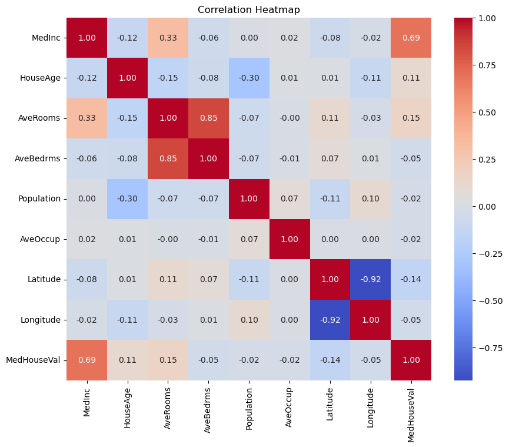

# Machine Learning Workflow

Machine Learning development is an [empirical process](https://www.deeplearning.ai/the-batch/iteration-in-ai-development/). So, when you start, don’t overthink and spend too much time on the design of the system, types of algorithms, model architecture, hyperparameters, and so on. Build the first version quick, get the feedback, analyze the result and improve your system iteratively.

The common steps of a machine learning project:
1. **Data Engineering**: Define, collect and preprocess data.
2. **Exploratory Data Analysis (EDA) and Feature Engineering**: Data Analysis, cleansing and visualization of data to understand its structure, relations, patterns, and potential issues. Then in an iterative process, transform and select data representations to best capture information relevant for model training and performance.
3. **Modeling**: Training, Validation, Evaluation, Tuning and iterate until the model is ready for deployment.
4. **Operation**: Deployment, Monitor the ongoing predictions, manage models and versions (artifacts organization), feedback loops and continuous learning/retraining, scaling, MLOps, etc.

Source: [mlflow.org](https://mlflow.org/docs/latest/introduction/index.html)

> The is not a linear process, but an **iterative** one. It's like a loop, and you may need to go back and forth between the steps.
>
> The above diagram shows **Feature Engineering** as a separate step, but in the real world, it's an ongoing activity during the EDA process. You explore, clean, and engineer features iteratively until you are satisfied with the read-to-training dataset.
>
> Steps 1 to 6 usually repeated in a loop until you get the desired results. However, in many cases you may need to go back to step 0 to collect more data or improve the quality of the data.

## Data Engineering

## Exploratory Data Analysis (EDA)

### Visualization Techniques
Visualzation techniques are key tools for EDA (Cleaning and Feature Engineering). So, this is not a separate step, but it's an ongoing activity during the EDA process.

Visualization is like a guide for you to help you to understand the data (stats, outliers, patterns, etc), and to make decisions about before and after data cleaning and feature engineering.

#### Scatter Plot Matrix
Also called Scatter Matrix, or Pairplot is a good way to visualize the relationships between multiple variables in a dataset. Each scatter plot in the matrix shows the relationship between two variables, with one variable on the x-axis and another on the y-axis.

Source from [Seaborn Pairplot Examples](https://seaborn.pydata.org/generated/seaborn.pairplot.html)

**Histograms**
Histograms are used to understand the distribution of a single variable (feature). It shows the frequency of the values of the variable.

 Source: [Seaborn Histograms](https://seaborn.pydata.org/generated/seaborn.histplot.html)

#### Heatmaps
Heatmaps are a type of data visualization tool that uses color-coding to represent different values across two dimensions, making it easier to see patterns, variances, or density in complex datasets. They are particularly useful for visualizing the structure, clustering, and correlation of data.

**Correlation** means that those two features are moving together. Correlation values range from -1 to 1. For example:
- Positive correlation is when one feature increases, the other feature also increases.
- Negative correlation is when one feature increases, the other feature decreases.

**Multi-collinearity Detection**
A common use of heatmap is to detect **multi-collinearity** between features. Multi-collinearity is a phenomenon in which two or more features in a dataset are highly correlated. This can cause problems in the model, such as unstable coefficients, and it can make it difficult to determine the effect of each feature on the target variable. In which those cases, we either:
- Remove one of the features (Feature Selection).
- Combine the features and create a new feature from them (New Feature Creation)

The following is an example of a correlation heatmap of house prices from [Scikit-Learn California Housing dataset](https://scikit-learn.org/stable/modules/generated/sklearn.datasets.fetch_california_housing.html).

**Some of Correlations Analysis:**
- Strong postive relationship between "MedInc" and "HouseValue" (0.69). It makes sense that the areas with higher income have higher house prices.
- Latitude shows a slightly negative correlation (-0.14) with MedHouseVal, which may indicate a trend where houses further north in the region are slightly less expensive.
- The feature "AveOccup" has a very weak correlation with the target variable (0.02), which indicates that it may not be a good predictor for the model. So, potentially we can consider removing it from the training data.

**Multi-collinearity Analysis:**
- The features "AveRooms" and "AveBedrms" are highly correlated (0.85).  So, we can consider removing one of the features.
- There is a strong correlation between "Latitude" and "Longitude" (-0.92) which in this case we can consider creating a new feature from them (e.g. distance from a specific point like the city center).

There are many other insights that can be extracted from the heatmap, and it's a good practice to use it as early as possible and iterate on it as you progress in the EDA and feature engineering process.

#### Box Plots
A boxplot, also known as a box-and-whisker plot, is a standardized way of displaying the distribution of data based on a five-number summary: minimum, first quartile (Q1), median, third quartile (Q3), and maximum. It can tell you about your outliers and what their values are. It can also tell you if your data is symmetrical, how tightly your data is grouped, and if and how your data is skewed.

Source: [Seaborn Grouped boxplots](https://seaborn.pydata.org/examples/grouped_boxplot.html)

Box plots are used to understand the distribution of a single variable (feature). It shows the median, quartiles, and outliers of the variable. In the above image, The small circles are the outliers.

> Although Box plots and Candlestick plots are similar, but Candlestick plots are used to visualize the stock data, and they show the open, close, high, and low prices of a stock over a period of time.

### Feature Engineering
See [Feature Engineering](ai/feature_engineering.md) for more details.

## Modeling

## Operation
