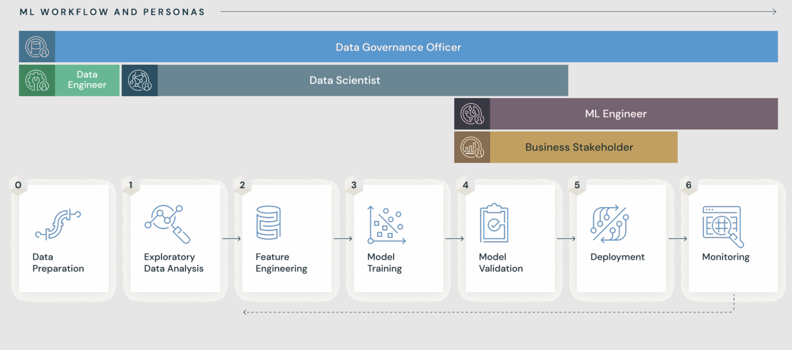

# Machine Learning Workflow

Machine Learning development is an [empirical process](https://www.deeplearning.ai/the-batch/iteration-in-ai-development/). So, when you start, don’t overthink and spend too much time on the design of the system, types of algorithms, model architecture, hyperparameters, and so on. Build the first version quick, get the feedback, analyze the result and improve your system iteratively.

The common steps of a machine learning project:
1. **Data Engineering**: Define, collect and preprocess data.
2. **Exploratory Data Analysis (EDA) and Feature Engineering**: Data Analysis, cleansing and visualization of data to understand its structure, relations, patterns, and potential issues. Then in an iterative process, transform and select data representations to best capture information relevant for model training and performance.
3. **Modeling**: Training, Validation, Evaluation, Tuning and iterate until the model is ready for deployment.
4. **Operation**: Deployment, Monitor the ongoing predictions, manage models and versions (artifacts organization), feedback loops and continuous learning/retraining, scaling, MLOps, etc.

Source: [mlflow.org](https://mlflow.org/docs/latest/introduction/index.html)

> The is not a linear process, but an **iterative** one. It's like a loop, and you may need to go back and forth between the steps.
>
> The above diagram shows **Feature Engineering** as a separate step, but in the real world, it's an ongoing activity during the EDA process. You explore, clean, and engineer features iteratively until you are satisfied with the read-to-training dataset.
>
> Steps 1 to 6 usually repeated in a loop until you get the desired results. However, in many cases you may need to go back to step 0 to collect more data or improve the quality of the data.

## Data Engineering

## Exploratory Data Analysis (EDA) and Feature Engineering

### Visualization Techniques
Visualzation techniques are key tools for EDA (Cleaning and Feature Engineering). So, this is not a separate step, but it's an ongoing activity during the EDA process.

Visualization is like a guide for you to help you to understand the data (stats, outliers, patterns, etc), and to make decisions about before and after data cleaning and feature engineering.

We use the following visualization techniques:

- **Histograms**: To show the distribution of a single variable.
- **Scatter Plots**: To show the relationship between two variables (feature vs feature, and feature vs target).
- **Pairplot**: To show the relationship between multiple variables. Similar to Scatter Plots, but it shows all possible combinations of variables.
- **Heatmaps**: To show the correlation between variables. To detect multi-collinearity between features. i.e. when two features move together (positive or negative correlation).
- **Box Plots**: To show the distribution of a single variable. It shows the median, quartiles, and outliers of the variable.

For seeing these visualizations in action, go to [Linear Regression using Scikit-Learn](labs/linear_regression_scikit_learn.ipynb).

### Feature Engineering
Feature engineering is the process of selecting the right features (feature reduction), creating new features from the existing features, and transforming the existing ones to new ones. It's a crucial step in the machine learning process, as it can significantly impact the performance of the model.

In feature engineering to verify our hypothesis, we use the visualization techniques (discussed above) to make the right decisions.

See further details here at [Feature Engineering](ai/feature_engineering.md).

## Modeling

## Operation
