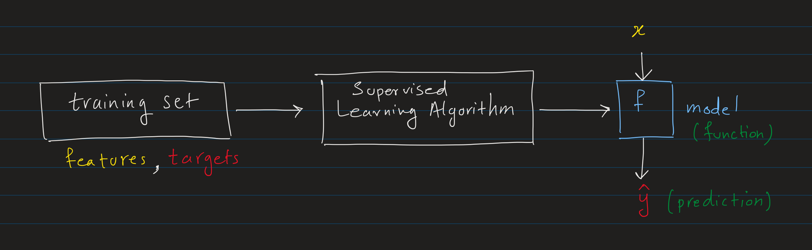
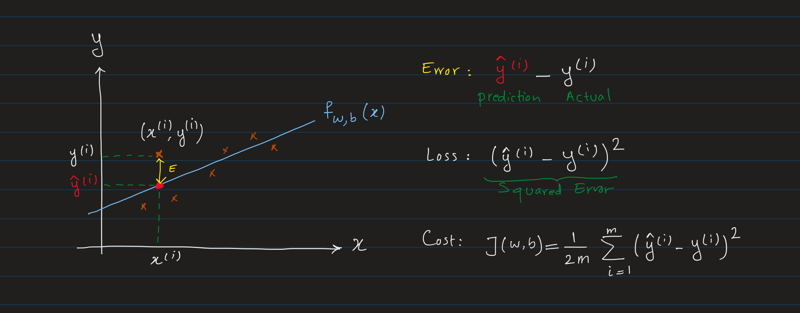
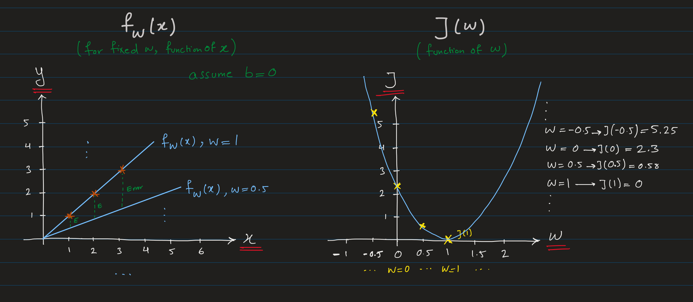

# Regression

Regression is a type of supervised learning algorithm that predicts a number (continuous value) based on input data. Regression models are trained on labeled data, pair of $Input(X) \rightarrow Output(Y)$ to make predictions on new, unseen data.

The model learns to predict a continuous value by comparing its predictions with the correct output during the training process.

## Notations
**Training set:** A data set which consists of list of training examples (pairs of input and output data).

$X$: **input** variable (features)

$Y$: **output** or **target** variable

$m$: Total number of training examples in the training set.

$n$: total number of features. e.g. in house price prediction, $n$ could be the number of features like size, location, number of bedrooms, etc.
> If $n=1$, it's called **univariate regression** or regression with one variable. If $n>1$, it's called **multivariate regression** or **multiple variable linear regression**.

$(x, y)$: Single training example

We use superscript to denote the index of the training example. For example, $x^{(i)}$ denotes the input features of the $i^{th}$ training example.

$(x^{(i)}, y^{(i)})$: $i^{th}$ training example

For example, for house price prediction _training set_ with $m = 4$ training examples with $n = 2$ features (size and number of bedrooms) and the target value (price) for each example:

Item | Size (m²) | Number of bedrooms | Price in $1000's|
| ---| --- | --- | --- |
| 1 | 210 | 3 | 400 |
| 2 | 150 | 2 | 300 |
| 3 | 120 | 2 | 250 |
| 4 | 300 | 4 | 500 |

Looking at the $1^{st}$ training example:

210 m², 3 bedrooms are the features of the first training example.
$$x^{(1)} = [210, 3]$$

As you can see, $x^{(1)}$ is not a number, it's list of numbers, that is a [vector](glossary.md#scalar-vector-matrix-tensor) which we represent as:

$$\vec{\mathbf{x}}^{(1)}$$

We use subscript $j$ to refer to a particular feature (e.g. size or number of bedrooms) of a particular training example.
$x^{(i)}_j$ denotes the $j^{th}$ feature of the $i^{th}$ training example.

For example, the second feature of the first training example is 3.

$$x^{(1)}_2 = 3$$

The output (target) value of the first training example is $400K.

$$y^{(1)} = 400$$

> The target value $y$ is a scalar value, so we don't need to use vector notation for it.

Then the complete notation of $1^{st}$ training example would be:

$$(\vec{\mathbf{x}}^{(1)}, y^{(1)}) = ([210, 3], 400)$$

which:
- $x_1^{(1)} = 210$
- $x_2^{(1)} = 3$

## How Regression Works

The traning set is a dataset that contains pairs of input features and target values. This dataset is given to the regression model to learn the relationship between the input features and the target value (by adjusting the model parameters to minimize the difference between the predicted value and the actual target value).

The supervised learning algorithm learns the relationship between the input features and the target value by optimizing the model parameters (using an optimization algorithm like [Gradient Descent](gradient_descent.md)) to minimize the difference between the predicted value and the actual target value.

A supervised learning algorithm typically consists of three key components:
- **Model (hypothesis function)**: A function that maps the input features to the predicted target value.
- **Cost Function**: A function that measures how well the model is performing by comparing the predicted versus actual target values.
- **Optimization Algorithm**: A method to minimize the cost function (the error between the predicted and actual target values) by adjusting the model parameters.

**Notations**:

$\vec{\mathbf{x}}$: Input features (provided in the training set).

$y$: Actual target value (provided in the training set).

$\hat{y}$: Predicted target value (output of the model).

$f$: The model (also called hypothesis) which is a function that maps the input features $\vec{\mathbf{x}}$ to the predicted target value $\hat{y}$.

$$f: \vec{\mathbf{x}} \rightarrow \hat{y}$$

For example, in the house price prediction example, the model $f$ would be a function that maps the size and number of bedrooms to the price of the house.

$$f: [size, bedrooms] \rightarrow price$$

where:
- $size$ and $bedrooms$ are the input features
- $price$ is the target value

> Note: In machine learning workflow, [feature engineering](feature_engineering.md) is an important step to select and transform the input features to best capture the information relevant for model training and performance. So, in this example, althgouh we have size and number of bedrooms as input features, we still need to make sure that these features are scaled, normalized, or transformed in a way that best represents the relationship between the input features and the target value.

## Linear Regression
The model function $f$ for linear regression is a linear function of the input feature $x$ (which is a function that maps from $x$ to $\hat{y}$).

**The Model:**

$$f_{w,b}(x) = w_{1}x_{1} + w_{2}x_{2} + ... + w_{n}x_{n} + b$$

where:
- $n$: total number of features
- $b$: bias term

> $w_{j}$ and $b$ are called the **parameters** of the model. Also called **weights** and **bias**.

When we have $n$ training examples, we can write the model function for the $i^{th}$ training example as:

$$f_{w,b}(x^{(i)}) = w_{1}x_{1}^{(i)} + w_{2}x_{2}^{(i)} + ... + w_{n}x_{n}^{(i)} + b$$

We can show the entire training set with $m$ training examples as a matrix $X$:

$$X = \begin{bmatrix} x_{1}^{(1)} & x_{2}^{(1)} & \dots & x_{n}^{(1)} \\ x_{1}^{(2)} & x_{2}^{(2)} & \dots & x_{n}^{(2)} \\ \vdots & \vdots & \ddots & \vdots \\ x_{1}^{(m)} & x_{2}^{(m)} & \dots & x_{n}^{(m)} \end{bmatrix}$$

where:
- $m$: total number of training examples
- $n$: total number of features
- $x_{j}^{(i)}$: The superscipt $i$ denotes the $i^{th}$ training example and the subscript $j$ denotes the $j^{th}$ feature of that training example.

Each row of the matrix $X$ represents a training example. For example, $x_2^{(3)}$ is the second feature of the third training example.

We can write each training example (row) as a vector $\vec{\mathbf{x}}^{(i)}$ which is a vectore of all features of the $i^{th}$ training example:

$$\vec{\mathbf{x}}^{(i)} = \begin{bmatrix} x_{1}^{(i)} \\ x_{2}^{(i)} \\ \vdots \\ x_{n}^{(i)} \end{bmatrix}$$

We can also write the weights $w$ as a vector $\vec{\mathbf{w}}$:

$$\vec{\mathbf{w}} = \begin{bmatrix} w_{1} \\ w_{2} \\ \vdots \\ w_{n} \end{bmatrix}$$

Now let's write the model in a vectorized form, which is the _dot product_ of two vectors of input features $\vec{\mathbf{x}}$ and weights $\vec{\mathbf{w}}$.

To compute the dot product of two vectors, one of them should be converted to a row vector. So, we take the _transpose_ of the weight vector $\vec{\mathbf{w}}$ to get a row vector $\vec{\mathbf{w}}^T$. Then the dot product of $\vec{\mathbf{w}}^T$ and $\vec{\mathbf{x}}^{(i)}$ gives a scalar value which is our goal in linear regression. More on this here at [vector and matrix operations](glossary.md#vector-and-matrix-operations)

So, the transpose of $\vec{\mathbf{w}}$ is:
$$\vec{\mathbf{w}}^T = \begin{bmatrix} w_{1} & w_{2} & \dots & w_{n} \end{bmatrix}$$

So, the model function can be written as:

$$f_{\vec{\mathbf{w}},b}(\vec{\mathbf{x}}^{(i)}) = \vec{\mathbf{w}}^T \cdot \vec{\mathbf{x}}^{(i)} + b$$

where:
- $\vec{\mathbf{x}}^{(i)}$ is a _vector_ of input features of $i^{th}$ training example, which is $\vec{\mathbf{x}}^{(i)} = [x_{1}^{(i)}, x_{2}^{(i)}, ..., x_{n}^{(i)}]$
- $\vec{\mathbf{w}}^T$ is the transpose of the weight vector $\vec{\mathbf{w}}$, which is $\vec{\mathbf{w}}^T = [w_{1}, w_{2}, ..., w_{n}]$
- $b$ is a scalar value (bias)

As described, the model output $\hat{y}$ is the predicted value of the target variable $y$. So, for the $i^{th}$ training example of a model with $n$ features, the predicted value $\hat{y}^{(i)}$ would be:

$$\hat{y}^{(i)} = f_{\vec{\mathbf{w}},b}(\vec{\mathbf{x}}^{(i)}) = \vec{\mathbf{w}}^T \cdot \vec{\mathbf{x}}^{(i)} + b$$

> For simplicity, this formula sometimes written without the transpose and ${i}^{th}$ index notations as follows:
> $$f_{\vec{\mathbf{w}},b}(\vec{\mathbf{x}}) = \vec{\mathbf{w}} \cdot \vec{\mathbf{x}} + b$$

### Single vs Multiple Features
As we saw earlier, the linear regression model with multiple features is defined as:

$$f_{\vec{\mathbf{w}},b}(\vec{\mathbf{x}}^{(i)}) = \vec{\mathbf{w}}^T \cdot \vec{\mathbf{x}}^{(i)} + b$$

In special case, when we have only one feature, the model called **univariate linear regression**. In this case, the model function $f_{w,b}(x)$ is defined as:

$$f_{w,b}(x^{(i)})= w x^{(i)} + b$$

This is the simplest form of regression model where the model tries to fit a straight line that best represents the relationship between one input feature and the target value. The above function is a linear function which represent a straight line with slope $w$ and y-intercept $b$. Different values of $w$ and $b$ will give different lines.

## Cost Function
We have defined our model as $f_{\vec{\mathbf{w}},b}(\vec{\mathbf{x}}^{(i)})$. But, how do we know which values of $\vec{\mathbf{w}}$ and $b$ are the best? We need a way to measure how well the model is performing. In other words, how far or close the predicted value $\hat{y}$ is to the actual target value $y$ (labels).

So, the goal here is to find the best values for $\vec{\mathbf{w}}$ and $b$ that minimize the difference between the predicted value $\hat{y}$ and the actual target value $y$ for all training examples.

For simplicity, we use a univariate linear regression model $f_{w,b}(x) = wx + b$ where we have only one feature $x$. We use this model to explain the concept of cost function and how to minimize it.

**Error**: is the difference between the predicted value (by the model), and the actual target value.

$$Error =y_{pred} - y_{actual}$$

In a more formal way, Error is the difference between predicted value of the model for the $i^{th}$ training example (denoted as ${\hat{y}}^{(i)}$) and the actual target value $y^{(i)}$.

$$Error(\hat{y}^{(i)}, y^{(i)}) = \hat{y}^{(i)} - y^{(i)}$$

**Loss function**: A function that measures how well the model's prediction $\hat{y}$ for a single training example is compared to the actual target value $y$.

The _squared error_  and _absolute error_ are common [loss functions](https://developers.google.com/machine-learning/crash-course/linear-regression/loss#types_of_loss) used in regression models. Here, we will use the squared error loss function.

Squared Error Loss function:

$$Loss(\hat{y}^{(i)}, y^{(i)}) = (\hat{y}^{(i)} - y^{(i)})^2$$

Knowing that $\hat{y}^{(i)} = f_{w,b}(x^{(i)})$, we can write the loss function as:

$$Loss(f_{w,b}(x^{(i)}),y^{(i)}) = (f_{w,b}(x^{(i)}) - y^{(i)})^2$$

**Cost function**: A function denoted by $J(w,b)$ that measures the average loss over all training examples. This function is also called **Mean Squared Error (MSE)**.

$$J(w,b) = \frac{1}{2m} \sum\limits_{i = 1}^{m} (f_{w,b}(x^{(i)}) - y^{(i)})^2$$

where:
- $m$: total number of training examples
- $f_{w,b}(x^{(i)})$: predicted value for the $i^{th}$ training example

> Note: The terms **Loss** and **Cost** are often used interchangeably in machine learning. So, in many cases, they refer to the same thing.

### Summary of MSE Cost Function for Linear Regression

In linear regression with one feature:
| Description | Notation |
| --- | --- |
| Model | $f_{w,b}(x) = wx + b$ |
| Model Parameters | $w, b$ |
| Cost Function | $J(w,b) = \frac{1}{2m} \sum\limits_{i = 1}^{m} (f_{w,b}(x^{(i)}) - y^{(i)})^2$ |
| Goal | Find the values of $w$ and $b$ that minimize the cost function $J(w,b)$ |

In more general form, for multiple features:
| Description | Notation |
| --- | --- |
| Model | $f_{\vec{\mathbf{w}},b}(\vec{\mathbf{x}}^{(i)}) = \vec{\mathbf{w}}^T \cdot \vec{\mathbf{x}}^{(i)} + b$ |
| Model Parameters | $\vec{\mathbf{w}}, b$ |
| Cost Function | $J(\vec{\mathbf{w}},b) = \frac{1}{2m} \sum\limits_{i = 1}^{m} (f_{\vec{\mathbf{w}},b}(\vec{\mathbf{x}}^{(i)}) - y^{(i)})^2$ |
| Goal |  $\vec{\mathbf{w}}, b = \arg\min J(\vec{\mathbf{w}},b)$ |

### Minimizing the Cost Function

Let's visualize the $f_{w,b}(x)$ and the cost function $J(w,b)$ side by side to understand how the cost function changes with different values of $w$ and $b$.

For simplicity, let's assume $b=0$:

$$f_{w,b}(x) = f_{w}(x) = wx$$
and
$$J(w) = \frac{1}{2m} \sum\limits_{i = 1}^{m} (f_{w}(x^{(i)}) - y^{(i)})^2$$

Recall, the notation of $f_{w}(x)$ means that for **fixed value of $w$**. e.g. when $w=2$, then $f_{2}(x) = 2x$, or simply $f(x) = 2x$ which is just a function of $x$.

The left side shows the model $f_{w,b}(x)$ which is a plot of $x$ and $y$. However, the right side shows the cost function $J(w,b)$ which is a plot of $w$ and $J$, showing the changes of cost $J$ with different values of $w$.

We can visually inspect the cost function $J(w)$ is at its minimum when $w$ is $1$.

Previously, we assumed $b=0$ for simplicity, the plot of cost function $J(w)$ is a 2D plot of $w$ and $J$ where $b$ is fixed at $0$. However, in reality, we have two parameters $w$ and $b$ that we need to optimize. So, the cost function $J(w,b)$ is a 3D plot of $w$, $b$, and $J$.

This is very similar to the 2D plot of $J(w)$, but now we have both $w$ and $b$ as parameters which create a 3D plot of $w$, $b$, and $J$.

MSE (Mean Squared Error) cost function is a [convex function](https://developers.google.com/machine-learning/glossary#convex-function) (bowl shape).

As we can see, the minimum of the cost function $J(w,b)$ is at the very bottom of the bowl (where the cost $J$ is the lowest). This is called the **global minimum** of the cost function which is indicated by dark blue color.

In the example above, our **parameter space** consists of two parameters, $w$ and $b$, making it a 3-dimensional space (including the cost function axis). However, when we have multiple features, the cost function $J(\vec{\mathbf{w}}, b)$  exists in an **$(n+1)$-dimensional** parameter space, where $n$ is the number of features (with $\vec{\mathbf{w}}$ representing the weight vector for each feature and $b$ the bias term). When we have high number of parameters in our parameter space, it commonly referred to as a **high-dimensional space**.

Obviously, we can't visualize the high-dimensional space (anything more than 3D), however the goal is still the same, to find the values of $\vec{\mathbf{w}}$ and $b$ that minimize the cost function $J(\vec{\mathbf{w}},b)$. So, we can mathematically find the minimum of the cost function using optimization algorithms like [Gradient Descent](gradient_descent.md) even in high-dimensional space. The process of achieving this goal is called **Training** the model.

**How to Minimize the Error (Cost function) Efficiently?**

Now we need an efficient way to find the best values of $w$ and $b$ that minimize the cost function $J$ in a systematic way. [Gradient Descent](gradient_descent.md) is one of the most important algorithms in machine learning for doing that. It is used not only in linear regression but also in larger and more complex models.

## Gradient Descent for Linear Regression
Gradient Descent is an optimization algorithm used to minimize the cost function $J(w,b)$ by iteratively moving towards the minimum of the cost function.  For more details see [Gradient Descent](gradient_descent.md).

So, we have the followings:
| Description | Notation |
| --- | --- |
| Model | $f_{w,b}(x) = wx + b$ |
| MSE Cost Function | $J(w,b) = \frac{1}{2m} \sum\limits_{i = 1}^{m} (f_{w,b}(x^{(i)}) - y^{(i)})^2$ |
| Gradient Descent Algorithm | $\text{repeat until convergence:}$  $\quad w = w - \alpha \frac{\partial J(w,b)}{\partial w}$  $\quad b = b - \alpha \frac{\partial J(w,b)}{\partial b}$

**Implementing Gradient Descent for Linear Regression:**

In order to implement the Gradient Descent algorithm, we need to calculate the partial derivatives of the cost function $J(w,b)$ with respect to the parameters $w$ and $b$.

Let's start with the first derivative term $\frac{\partial J(w,b)}{\partial w}$.

$$\frac{\partial J(w,b)}{\partial w} = \frac{\partial}{\partial w} \left( \frac{1}{2m} \sum\limits_{i = 1}^{m} (f_{w,b}(x^{(i)}) - y^{(i)})^2 \right)$$

We know $f_{w,b}(x) = wx + b$, so we can substitute $f_{w,b}(x)$ in the above equation:

$$\frac{\partial J(w,b)}{\partial w} = \frac{\partial}{\partial w} \left( \frac{1}{2m} \sum\limits_{i = 1}^{m} (wx^{(i)} + b - y^{(i)})^2 \right)$$

Using the [chain rule](../math/derivatives.md#chain-rule) of derivatives, we can calculate the derivative of the above equation:

$$\frac{\partial J(w,b)}{\partial w} = \frac{1}{m} \sum\limits_{i = 1}^{m} (wx^{(i)} + b - y^{(i)})x^{(i)}$$

Similarly, we can calculate the partial derivative of the cost function $J(w,b)$ with respect to the parameter $b$:

$$\frac{\partial J(w,b)}{\partial b} = \frac{1}{m} \sum\limits_{i = 1}^{m} (wx^{(i)} + b - y^{(i)})$$

So, the Gradient Descent algorithm for linear regression can be written as:

$$\begin{align*} \text{repeat}&\text{ until convergence: } \lbrace \newline
& w = w - \alpha \frac{1}{m} \sum\limits_{i = 1}^{m} (f_{w,b}(x^{(i)}) - y^{(i)})x^{(i)} \newline
& b = b - \alpha \frac{1}{m} \sum\limits_{i = 1}^{m} (f_{w,b}(x^{(i)}) - y^{(i)}) \newline \rbrace
\end{align*}$$

### Gradient Descent with Multiple Features
In case of having multiple features, the model function $f_{\vec{\mathbf{w}},b}(\vec{\mathbf{x}}^{(i)})$ is a dot product of the weight vector $\vec{\mathbf{w}}$ and the input features vector $\vec{\mathbf{x}}^{(i)}$

When model has $n$ parameters (weights) $w_1, w_2, ..., w_n$ and a bias term $b$, the Gradient Descent algorithm for multiple linear regression can be written as:

$$f_{\vec{\mathbf{w}},b}(\vec{\mathbf{x}}^{(i)}) = w_{1}x_{1}^{(i)} + w_{2}x_{2}^{(i)} + ... + w_{n}x_{n}^{(i)} + b$$

> Recall: For each feature we have a weight $w_j$. So, for $n$ features, we have $n$ weights $w_1, w_2, ..., w_n$. In linear regression, the number of weights is always equal to the number of features.

And using the vector notation, we can write the parameters as a vector with length $n$:
$$\vec{\mathbf{w}} = \begin{bmatrix} w_{1} \\ w_{2} \\ \vdots \\ w_{n} \end{bmatrix}$$

So, the model function can be written as:

$$f_{\vec{\mathbf{w}},b}(\vec{\mathbf{x}}^{(i)}) = \vec{\mathbf{w}} \cdot \vec{\mathbf{x}}^{(i)} + b$$

The cost function $J(w_1, w_2, ..., w_n, b)$ for multiple linear regression is:

$$J(\vec{\mathbf{w}},b) = \frac{1}{2m} \sum\limits_{i = 1}^{m} (f_{\vec{\mathbf{w}},b}(\vec{\mathbf{x}}^{(i)}) - y^{(i)})^2$$

Gradient Descent:

$$\begin{align*} \text{repeat}&\text{ until convergence: } \lbrace \newline
& w_j = w_j -  \alpha \frac{\partial J(\vec{\mathbf{w}},b)}{\partial w_j} \; & \text{for j = 0..n-1}\newline
&b\ \ = b -  \alpha \frac{\partial J(\vec{\mathbf{w}},b)}{\partial b}  \newline \rbrace
\end{align*}$$

Now the partial derivative of the cost function $J(\vec{\mathbf{w}},b)$ with respect to the parameters $w_j$ and $b$ is:

$$\frac{\partial J(\vec{\mathbf{w}},b)}{\partial w_j} = \frac{1}{m} \sum\limits_{i = 1}^{m} (f_{\vec{\mathbf{w}},b}(\vec{\mathbf{x}}^{(i)}) - y^{(i)})x^{(i)}_j$$

So we can rewrite the Gradient Descent algorithm for multiple linear regression as:

$$\begin{align*} \text{repeat}&\text{ until convergence: } \lbrace \newline
& w_j = w_j - \alpha \frac{1}{m} \sum\limits_{i = 1}^{m} (f_{\vec{\mathbf{w}},b}(\vec{\mathbf{x}}^{(i)}) - y^{(i)})x^{(i)}_j \; & \text{for j = 0..n-1}\newline
& b = b - \alpha \frac{1}{m} \sum\limits_{i = 1}^{m} (f_{\vec{\mathbf{w}},b}(\vec{\mathbf{x}}^{(i)}) - y^{(i)}) \newline \rbrace
\end{align*}$$
