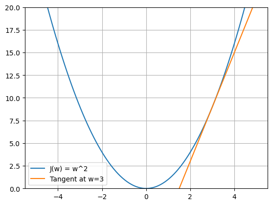

# Derivatives

To understand derivatives, it's important to first understand the concept of **slope**.

## Slope
The slope of a line is a measure of how much the line rises or falls vertically for each unit of horizontal movement.

$$\text{Slope} = \frac{\text{rise}}{\text{run}} = \frac{\Delta y}{\Delta x}$$

where:
- $\Delta y$ is the change in the vertical direction
- $\Delta x$ is the change in the horizontal direction.

This is also known as the **rise over run** formula.

If we denote the slope of a line as $m$, then the slope of the line passing through two points $(x_1, y_1)$ and $(x_2, y_2)$ is given by:

$$m = \frac{{\text{{change in }} y}}{{\text{{change in }} x}} = \frac{{\Delta y}}{{\Delta x}} = \frac{{y_2 - y_1}}{{x_2 - x_1}}$$

The equation for a tangent line to a function between two points $(x_1, y_1)$ and $(x_2, y_2)$ is given by:

$$y_2 - y_1 = m(x_2 - x_1)$$

where:
- $(x_1, y_1)$ is a point on the line
- $(x_2, y_2)$ is another point on the line
- $m$ is the slope of the line.

**Average Rate of Change:** 
The average rate of change of a function over an interval is the slope of the line connecting the two points at the ends of the interval. It is calculated as the change in the function value divided by the change in the input variable over that interval.

The average rate of change of a function $y = f(x)$ is the slope of the line connecting two points $(x_1, y_1)$ and $(x_2, y_2)$ on the curve.

$$ m = \frac{\Delta y}{\Delta x} = \frac{f(x_2) - f(x_1)}{x_2 - x_1}$$

where:
- $m$ is the average rate of change of the function over the interval $(x_1, x_2)$.

So, we can define the slope line between two points $(x_1, y_1)$ and $(x_2, y_2)$ as:

$$y - y_1 = m(x - x_1) \implies y = m(x - x_1) + y_1$$

where:
- $m$ is the slope of the line connecting the two points
- $(x_1, y_1)$ is a point on the line.

## Derivative and Tangent Line
As we discussed, the slope between two points gives us the average rate of change of a function over an interval. However, what if we want to measure the rate of change at a specific point on the function? We need to find the slope of the curve when these two points are very close to each other. So, the derivative emerges when those two points, $x_1$ and $x_2$, get infinitely close to each other, effectively collapsing into a single point. This process requires taking the **limit** as $x_2 \to x_1$ or in other words, $\Delta x \to 0$.

So, the derivative of a function $f(x)$ at a point $x$ is defined as:

$$\frac{df(x)}{dx} = \lim_{\Delta x \to 0} \frac{f(x+\Delta x)-f(x)}{\Delta x}$$

Let's assume the difference between $x_2$ and $x_1$ is called $\epsilon$ (epsilon), which means $\Delta x = \epsilon$. Then the derivative is the limit as $\epsilon$ approaches zero:

$$\frac{df(x)}{dx}=\lim_{\epsilon\to 0} \frac{f(x+\epsilon)-f(x)}{\epsilon}$$

> Derivative of a function measures the rate of change of the function at a particular point. In other words, derivative of $f(x)$ is finding what would be the impact on function $f(x)$, when we make a very tiny change on $x$.
> $$\frac{df(x)}{dx}=\frac{\text{Changes of }f(x)}{\text{In respect to very tiny changes of }x}$$
> 
> The derivative of a function $f(x)$ is denoted $\frac{df}{dx}$ or using prime notation $f'(x)$.  The symbol $d$ in $\frac{df}{dx}$ is called "differential" and represents a small change in the function $f(x)$ due to a small change in $x$.

 

**Tangent Line:** 
As we discussed, slope is a measure of average rate of change over an interval (between two points on a function). However as we discussed, for measuring the rate of change at a specific point, we need to assume the interval between two points is infinitesimally small.

Tangent Line is the slope of the function when the interval between two points is infinitesimally small. It is like a line that just touches the curve at a specific point (without crossing it). The slope of this tangent line at a point is the derivative of the function at that point.

The following plot shows the function $J(w) = w^2$ and the tangent line at $w=3$:

**Example:** 
Let's compute the derivative of $f(x)=x^2$ step by step using this definition:

First, plug $f(x) = x^2$ into the limit definition:

$$\frac{df(x)}{dx}=\lim_{\epsilon\to 0} \frac{(x+\epsilon)^2-x^2}{\epsilon}$$

Then expand the numerator:

$$\frac{df(x)}{dx}=\lim_{\epsilon\to 0} \frac{x^2+2x\epsilon+\epsilon^2-x^2}{\epsilon}$$

Simplify by cancelling $x^2$ in the numerator:

$$\frac{df(x)}{dx}=\lim_{\epsilon\to 0} \frac{2x\epsilon+\epsilon^2}{\epsilon}$$

Factor out $\epsilon$ from the numerator, and cancel it with the denominator:

$$\frac{df(x)}{dx}=\lim_{\epsilon\to 0} (2x+\epsilon)$$

Finally, as $\epsilon$ approaches zero, the second term in the parenthesis disappears (as it also approaches zero), and we are left with:

$$\frac{df(x)}{dx}=2x$$

So the derivative of $f(x) = x^2$ is $2x$, as expected.

## Partial and Total Derivatives

There are two types of derivatives that are commonly used in calculus: the **total derivative** and the **partial derivative**:

1. **Total Derivative (or simply Derivative) ($\frac{d}{dw}$):** When the function depends on a single variable, we often use $\frac{d}{dw}$ to denote the derivative. For example, if $J(w)$ is a function of $w$, the derivative of $J(w)$ with respect to $w$ is written as:

$$\frac{dJ(w)}{dw}$$

2. **Partial Derivative ($\frac{\partial}{\partial w_i}$):** When the function depends on more than one variable, we use the partial derivative notation. For instance, if $J$ is a function of multiple variables, say $w_1, w_2, \ldots, w_n$, and we want to find out how $J$ changes with respect to $w_i$ while keeping other variables constant, we use the notation:

$$\frac{\partial}{\partial w_i} J(w_1, w_2, \ldots, w_n)$$

The symbol $\partial$ (called "del" or "partial") is used to denote partial derivatives, as opposed to the $d$ for ordinary derivatives. This distinction is necessary to indicate that only one variable is considered for the change, while others are held constant.

**Example:**

Let's define a function $J(w_1, w_2) = w_1^2w_2 + w_2^3$.

1. The partial derivative of $J$ with respect to $w_1$ (keeping $w_2$ constant) is obtained by differentiating $J$ with respect to $w_1$ and treating $w_2$ as a constant:

$$\frac{\partial J}{\partial w_1} = \frac{\partial}{\partial w_1}(w_1^2w_2) + \frac{\partial}{\partial w_1}(w_2^3) = 2w_1w_2 + 0 = 2w_1w_2$$

2. The partial derivative of $J$ with respect to $w_2$ (keeping $w_1$ constant) is obtained by differentiating $J$ with respect to $w_2$ and treating $w_1$ as a constant:

$$\frac{\partial J}{\partial w_2} = \frac{\partial}{\partial w_2}(w_1^2w_2) + \frac{\partial}{\partial w_2}(w_2^3) = w_1^2 + 3w_2^2$$

As you can see, the partial derivatives of the function $J(w_1, w_2)$ with respect to $w_1$ and $w_2$ are different in this example.

## Chain Rule
The chain rule is a fundamental tool in calculus for computing the derivative of a function composition. It allows us to break down complex functions into simpler ones when differentiating.

Formally, suppose we have a function $f$ of $x$, which is a composition of function $g$ of $x$:

$$f(x) = f(g(x))$$

The chain rule states that the derivative of $f$ with respect to $x$ can be computed by multiplying the derivative of $f$ with respect to $g$ by the derivative of $g$ with respect to $x:

$$\frac{df}{dx} = \frac{df}{dg} \cdot \frac{dg}{dx}$$

For simplicity, we usually use variables like $u$, $v$, and $w$, ... to represent intermediate functions. For example, when function $f$ of $x$ is a composition of function $g$ of $x$, we can write it as:
$$u = g(x)$$
$$f(x) = f(g(x)) = f(u)$$

Then the chain rule can be written as:
$$\frac{df}{dx} = \frac{df}{du} \cdot \frac{du}{dx}$$

**Prime Notation:**

The chain rule can also be written in a different notation that uses prime notation, $f'(x)$, for derivatives. Here, $f'(x)$ represents the derivative of function $f$ at the point $x$.

Given that $i(x) = f(g(x))$, the chain rule can be written as:

$$i'(x) = f'(g(x)) \cdot g'(x)$$

For the case where we have three functions composed together, if $i(x)=p(g(h(x)))$, using the prime notation, the chain rule can be written as:

$$i'(x) = p'(g(h(x))) \cdot g'(h(x)) \cdot h'(x)$$

This tells us that the derivative of the composed function at $x$ is the product of the derivative of $p$ at $g(h(x))$, the derivative of $g$ at $h(x)$, and the derivative of $h$ at $x$.

This is the chain rule in prime notation. It is equivalent to the one using $\frac{df}{dx}$ notation, and the choice between them is usually a matter of personal preference or context.

**Number of Compositions:**

The chain rule can be extended to any number of compositions. For instance, if we have 4 functions composed together, $f(g(h(i(x))))$, the derivative would be:

$$\frac{d}{dx}[f(g(h(i(x))))] = \frac{df}{dg}\frac{dg}{dh}\frac{dh}{di}\frac{di}{dx}$$

The chain rule is crucial in many areas of calculus, including the computation of complex derivatives and integrals, and forms the basis of backpropagation in machine learning.

- This [tutorial](https://www.khanacademy.org/math/ap-calculus-ab/ab-differentiation-2-new/ab-3-1a/v/chain-rule-introduction) is a good tutorial on the chain rule.
- This [video](https://youtu.be/YG15m2VwSjA) is also another good intro to the chain rule.

### Examples

#### Simple Composite Function
Suppose you have a function:

$$f(x) = \left(3x + 1\right)^2$$

This is a **composite function** because it consists of two parts:
- The **inner function** is $g(x) = 3x + 1$.
- The **outer function** is $f(u) = u^2$, where $u = g(x) = 3x + 1$.

$$f(x) = f(g(x))$$

Using the chain rule:
$$\frac{df}{dx} = \frac{df}{dg} \cdot \frac{dg}{dx}$$

Rewriting the above using the new variable $u = g(x)$:
$$\frac{df}{dx} = \frac{df}{du} \cdot \frac{du}{dx}$$

1. Differentiate the outer function $f(u) = u^2$:
   $$\frac{d}{du}(u^2) = 2u$$

2. Differentiate the inner function $g(x) = 3x + 1$:
   $$\frac{d}{dx}(3x + 1) = 3$$

3. Apply the chain rule by multiplying:
   $$\frac{df}{dx} = 2u \cdot 3$$

To get the final derivative of $f$ with respect to $x$, we need to substitute back $u = 3x + 1$:
$$\frac{df}{dx} = 2(3x + 1) \cdot 3 = 6(3x + 1)$$

**Example:**

Now let's go through another example with a bit more complex function composition. We are given function $f$ of $x$ as follows:

$$f(x) = ((x + 1)^3)^2$$

The goal is to break this into smaller functions, so we can apply the chain rule effectively. We start with the **innermost operation** and work our way out:
   $$h(x) = x + 1$$
   $$g(w) = w^3 \quad \text{where} \quad w = h(x) = x + 1$$
   $$f(v) = v^2 \quad \text{where} \quad v = g(w) = (x + 1)^3$$

Now, to find the derivative of the original function, let’s rewrite the composition:

$$f(x) = \left((x + 1)^3\right)^2 = f(g(h(x)))$$

The derivative of this composition using the chain rule would be:

$$\frac{df}{dx} = \frac{d}{dx}[f(g(h(x)))]$$

Which we can rewrite as:

$$\frac{df}{dx} = \frac{df}{dg} \cdot \frac{dg}{dh} \cdot \frac{dh}{dx}$$

Or using $w$ and $v$ as intermediate variables, we can write this as:

$$\frac{df}{dx} = \frac{df}{dv} \cdot \frac{dv}{dw} \cdot \frac{dw}{dx}$$

Step-by-step differentiation:

1. Differentiate $f(v) = v^2$ with respect to $v$:
   $$\frac{df}{dv} = 2v$$

2. Differentiate $g(w) = w^3$ with respect to $w$:
   $$\frac{dv}{dw} = 3w^2$$

3. Differentiate $h(x) = x + 1$ with respect to $x$:
   $$\frac{dw}{dx} = 1$$

So:

$$\frac{d}{dx}[f(g(h(x)))] = 2v \cdot 3w^2 \cdot 1$$

Finally, to get the derivative of $f(x)$ with respect to $x$, we need to substitute back the intermediate variables $v$ and $w$:
If we substitute everything back, $v = (x + 1)^3$ and $w = x + 1$, we get:

$$\frac{df}{dx} = 2(x + 1)^3 \cdot 3(x + 1)^2 = 6(x + 1)^5$$

#### Derivative of Exponential Function
See [Derivative of Exponential Function](euler_number.md#derivative-of-exponentials).

#### Derivative of $e^{ax}$
Let's calculate the derivative of $e^{ax}$, where $a$ is a constant.

$$f(x) = e^{ax}$$

Based on what we saw in [Derivative of Exponential Function](euler_number.md#derivative-of-exponentials), the derivative of $e^{x}$ is itself $e^{x}$. However, $ax$ is a composition of two functions: the exponential function $e^x$ and the linear function $ax$. To find the derivative of $f(x) = e^{ax}$, we use the **chain rule**.

Let's denote $u = ax$, So:

$$f(u) = e^u$$

The chain rule states:

$$\frac{df}{dx} = \frac{df}{du} \cdot \frac{du}{dx}$$

First, compute the derivative of $e^u$ with respect to $u$:
$$\frac{df}{du} = \frac{d}{du} e^u = e^u$$

Next, compute the derivative of $g(x) = ax$ with respect to $x$:
$$\frac{du}{dx} = \frac{d}{dx} ax = a$$

Now, apply the chain rule by multiplying these results:
$$\frac{df}{dx} = e^{ax} \cdot a$$

**Final Answer:**
$$\frac{d}{dx} e^{ax} = a e^{ax}$$

**Intuition:** 
The intuition behind the derivative of $e^{ax}$ is that the function grows or decays proportionally to its value, but the rate of this change depends on $a$. A larger $a$ means faster growth, a smaller $a$ means slower growth, and a negative $a$ causes decay. The derivative $a \cdot e^{ax}$ captures this by scaling the natural growth rate of $e^{ax}$ by $a$.

#### Derivative of Natural Logarithm

Let's calculate the derivative of the natural logarithm function $\ln(x)$ using the chain rule.

$$y = \ln(x)$$

Using the [logarithmic rule](algebra_basics.md#logarithms), we can rewrite this as:

$$e^y = x$$

Differentiate both sides with respect to $x$:

$$\frac{d}{dx}[e^y] = \frac{d}{dx}[x]$$

Knowing that derivative of $x$ with respect to $x$ is 1, we get:

$$\frac{d}{dx}[e^y] = 1$$

The derivative of $e^y$ with respect to $x$ requires the **chain rule**, because $y$ is a function of $x$. The chain rule says:
Let's denote $u = y$ and $f(u) = e^u$:
$$u = y$$
$$f(u) = e^u$$

The chain rule will be:

$$\frac{df}{dx} = \frac{df}{du} \cdot \frac{du}{dx}$$

The derivative of $e^u$ with respect to $u$ is simply $e^u$. See [Derivative of Exponential Function](euler_number.md#derivative-of-exponentials) for more details:
$$\frac{df}{du} = e^u$$

So, the chain rule gives us:
$$\frac{df}{dx} = e^u \cdot \frac{du}{dx}$$

Knowing that $u = y$, we can substitute $u$ back to $y$:

$$\frac{df}{dx} = e^y \cdot \frac{dy}{dx}$$

We saw earlier that $\frac{d}{dx}[e^y] = 1$, so we can substitute this back:

$$e^y \cdot \frac{dy}{dx} = 1$$

Substitute $e^y = x$ back into the equation:

$$x \cdot \frac{dy}{dx} = 1$$

Finally, solve for $\frac{dy}{dx}$:
$$\frac{dy}{dx} = \frac{1}{x}$$

#### Derivative of Sigmoid Function

We start with the sigmoid function, defined as:

$$\sigma(x) = \frac{1}{1+e^{-x}}$$

Let's first rewrite the function slightly to make differentiation easier:

$$\sigma(x) = (1+e^{-x})^{-1}$$

Now, let's use the chain rule to differentiate. Let's inner function $u = 1 + e^{-x}$, so:

$$u(x) = 1 + e^{-x}$$
$$\sigma(u) = u^{-1}$$

So, the sigmoid function can be written as a composition of functions:
$$\sigma(x) = \sigma(u(x))$$

Using the chain rule, the derivative of $\sigma(x)$ with respect to $x$ is:

$$\frac{d\sigma}{dx} = \frac{d\sigma}{du} \cdot \frac{du}{dx}$$

Differentiate the outer function $\sigma(u)$ with respect to $u$:

$$\frac{d\sigma}{du} = \frac{d}{du} u^{-1} = -u^{-2}$$

Differentiate the inner function $u(x)$ with respect to $x$. Derivative of $e^{-x}$ is $-e^{-x}$ as we saw earlier in Derivative of $e^{ax}$.

$$\frac{du}{dx} = \frac{d}{dx} (1 + e^{-x}) = 0 - e^{-1 \times x} = -1 \times e^{-x}$$

So:
$$
\frac{d\sigma}{dx} = -u^{-2} \cdot -e^{-x} = \frac{e^{-x}}{(1+e^{-x})^2} = \frac{1}{1+e^{-x}} \cdot \frac{e^{-x}}{1+e^{-x}}
$$

Let's add and subtract 1 in the numerator of the second term.

$$e^{-x} = (1 + e^{-x}) - 1$$

Substitute this back into the derivative:

$$\frac{d\sigma}{dx} = \frac{1}{1+e^{-x}} \left(\frac{1+e^{-x}-1}{1+e^{-x}}\right)=\frac{1}{1+e^{-x}} \left(1 - \frac{1}{1+e^{-x}}\right)$$

We know that $\sigma(x) = \frac{1}{1+e^{-x}}$, so the derivative can be written as:

$$
\frac{d\sigma}{dx} = \sigma(x)(1-\sigma(x))
$$

#### Derivative of the Mean Squared Error (MSE) Function

MSE defined as:
$$J(w,b) = \frac{1}{2m} \sum_{i=1}^{m} (f_{w}(x^{(i)}) - y^{(i)})^2$$

Where:
- $f_{w}(x) = wx + b$ is a linear regression model.
- $x^{(i)}$ is the input feature for the $i^{th}$ example.
- $y^{(i)}$ is the actual target value for the $i^{th}$ example.
- $m$ is the total number of training examples.

So, we can write it as:
$$J(w,b) = \frac{1}{2m} \sum_{i=1}^{m} (wx^{(i)} + b - y^{(i)})^2$$

Let's define the inner function:
$$u = g(w) = wx^{(i)} + b - y^{(i)}$$
> Note: We use $u$ instead of $u^{(i)}$ for simplicity.

Then, the cost function $J(w)$ can be written as a composition of functions:

$$J(w) = J(g(w)) = J(u) = \frac{1}{2m} \sum_{i=1}^{m} u^2$$

Now, we can apply the chain rule to find the derivative of $J(w)$ with respect to $w$:

$$\frac{dJ(w)}{dw} = \frac{dJ(u)}{du} \cdot \frac{du}{dw}$$

$$\frac{dJ(w)}{dw} = \frac{1}{m} \sum_{i=1}^{m} u \cdot x$$

Substitute back $u = wx^{(i)} + b - y^{(i)}$:

$$\frac{dJ(w)}{dw} = \frac{1}{m} \sum_{i=1}^{m} (wx^{(i)} + b - y^{(i)}) \cdot x^{(i)}$$

#### Derivative of the Logistic Regression Cost Function

To calculate the derivative (gradient) of $J(\vec{\mathbf{w}}, b)$ with respect to $\vec{\mathbf{w}}$, let's go step by step.

The cost function is:

$$
J(\vec{\mathbf{w}},b) = -\frac{1}{m} \sum_{i=1}^{m} \left[ y^{(i)} \log(f_{\vec{\mathbf{w}},b}(\vec{\mathbf{x}}^{(i)})) + (1 - y^{(i)}) \log(1 - f_{\vec{\mathbf{w}},b}(\vec{\mathbf{x}}^{(i)})) \right]
$$

Here:
- $f_{\vec{\mathbf{w}},b}(\vec{\mathbf{x}}^{(i)})$ is a logistic regression model, defined as:
  $$f_{\vec{\mathbf{w}},b}(\vec{\mathbf{x}}^{(i)}) = \sigma(\vec{\mathbf{w}} \cdot \vec{\mathbf{x}}^{(i)} + b)$$
  where $\sigma(z) = \frac{1}{1 + e^{-z}}$.

Let $z^{(i)} = \vec{\mathbf{w}} \cdot \vec{\mathbf{x}}^{(i)} + b$, so $f_{\vec{\mathbf{w}},b}(\vec{\mathbf{x}}^{(i)}) = \sigma(z^{(i)})$.

**Partial Derivative with Respect to $\vec{\mathbf{w}}$
1. Rewrite $J(\vec{\mathbf{w}}, b)$: Substituting $f_{\vec{\mathbf{w}},b}(\vec{\mathbf{x}}^{(i)}) = \sigma(z^{(i)})$:

   $$
   J(\vec{\mathbf{w}}, b) = -\frac{1}{m} \sum_{i=1}^{m} \left[ y^{(i)} \log(\sigma(z^{(i)})) + (1 - y^{(i)}) \log(1 - \sigma(z^{(i)})) \right]
   $$

2. Focus on the derivative of a single term in the summation: Let:

   $$
   L^{(i)} = -\left[ y^{(i)} \log(\sigma(z^{(i)})) + (1 - y^{(i)}) \log(1 - \sigma(z^{(i)}) \right]
   $$

   We need $\frac{\partial L^{(i)}}{\partial \vec{\mathbf{w}}}$.

3. Take the derivative of $L^{(i)}$: Use the chain rule:

   $$
   \frac{\partial L^{(i)}}{\partial \vec{\mathbf{w}}} = \frac{\partial L^{(i)}}{\partial \sigma(z^{(i)})} \cdot \frac{\partial \sigma(z^{(i)})}{\partial z^{(i)}} \cdot \frac{\partial z^{(i)}}{\partial \vec{\mathbf{w}}}
   $$

4. Compute each term:
    - $\frac{\partial L^{(i)}}{\partial \sigma(z^{(i)})}$: Differentiate $L^{(i)}$ with respect to $\sigma(z^{(i)})$:
        $$
        \frac{\partial L^{(i)}}{\partial \sigma(z^{(i)})} = -\frac{y^{(i)}}{\sigma(z^{(i)})} + \frac{1 - y^{(i)}}{1 - \sigma(z^{(i)})}
        $$
        Note that in above we also needed to use chain rule again for the derivative of $\log(1-\sigma(z^{(i)})$ as $(1-\sigma(z^{(i)}))$ is a function of $z^{(i)}$. Let's denote $u = \sigma(z^{(i)})$.
        $$
        \frac{\partial \log(1-u)}{\partial u} = \frac{\partial \log(1-u)}{\partial (1-u)} \cdot \frac{\partial (1-u)}{\partial u} = -\frac{1}{1-u}$$

         The derivative of $\log(1-\sigma(z^{(i)})$ with respect to $\sigma(z^{(i)})$ is $-\frac{1}{1-\sigma(z^{(i)})}$.

    - $\frac{\partial \sigma(z^{(i)})}{\partial z^{(i)}}$: The derivative of the sigmoid function $\sigma(z)$ is (See [Derivative of Sigmoid Function](#derivative-of-sigmoid-function) for more details):

        $$
        \frac{\partial \sigma(z)}{\partial z} = \sigma(z)(1 - \sigma(z))
        $$

    - $\frac{\partial z^{(i)}}{\partial \vec{\mathbf{w}}}$: Since $z^{(i)} = \vec{\mathbf{w}} \cdot \vec{\mathbf{x}}^{(i)} + b$, we have:
        $$
        \frac{\partial z^{(i)}}{\partial \vec{\mathbf{w}}} = \vec{\mathbf{x}}^{(i)}
        $$

5. Combine these results:
    $$\frac{\partial L^{(i)}}{\partial \vec{\mathbf{w}}} = \left( -\frac{y^{(i)}}{\sigma(z^{(i)})} + \frac{1 - y^{(i)}}{1 - \sigma(z^{(i)})} \right) \cdot \sigma(z^{(i)})(1 - \sigma(z^{(i)})) \cdot \vec{\mathbf{x}}^{(i)}$$

6. Simplify the term in parentheses:
   Use the fact that $\sigma(z^{(i)}) = f_{\vec{\mathbf{w}},b}(\vec{\mathbf{x}}^{(i)})$:
    $$
    -\frac{y^{(i)}}{\sigma(z^{(i)})} + \frac{1 - y^{(i)}}{1 - \sigma(z^{(i)})} = \sigma(z^{(i)}) - y^{(i)}
    $$

    So:
    $$
    \frac{\partial L^{(i)}}{\partial \vec{\mathbf{w}}} = (\sigma(z^{(i)}) - y^{(i)}) \cdot \vec{\mathbf{x}}^{(i)}
    $$
Now, to get the derivative of the cost function $J(\vec{\mathbf{w}}, b)$ with respect to $\vec{\mathbf{w}}$, we sum over all training examples:
   The gradient of $J(\vec{\mathbf{w}}, b)$ with respect to $\vec{\mathbf{w}}$ is:
    $$
    \frac{\partial J}{\partial \vec{\mathbf{w}}} = \frac{1}{m} \sum_{i=1}^{m} (\sigma(z^{(i)}) - y^{(i)}) \cdot \vec{\mathbf{x}}^{(i)}
    $$

We can apply the same steps to find the derivative of $J(\vec{\mathbf{w}}, b)$ with respect to $b$. The final result for the gradient of $J(\vec{\mathbf{w}}, b)$ with respect to $b$ is:
$$
\frac{\partial J}{\partial b} = \frac{1}{m} \sum_{i=1}^{m} (\sigma(z^{(i)}) - y^{(i)})
$$
### Rate of Change

When we're taking the derivative of a function, we're trying to understand how fast the function is changing at a particular point. If we have a complex function formed by composing several simpler functions, we're interested in how fast that whole composition is changing.

Let's consider a composed function $h(x) = f(g(x))$. If we want to find out how fast $h$ changes with respect to $x$, we can break down this change into two parts:

1. How fast does $f$ change with respect to $g$ (i.e., $\frac{df}{dg}$)? This part tells us how a small change in $g$ would affect $f$.

2. How fast does $g$ change with respect to $x$ (i.e., $\frac{dg}{dx}$)? This part tells us how a small change in $x$ would affect $g$.

The chain rule combines these two rates of change to find out how fast $h$ changes with respect to $x$. If we change $x$ a little bit, this change propagates through $g$, then $f$, causing $h$ to change. The chain rule basically says that the total change in $h$ is the product of these two rates of change.

Now, if we add more functions to the chain, the same logic applies. For $h(x) = f(g(i(x)))$, we would compute $\frac{df}{dg}$, $\frac{dg}{di}$, and $\frac{di}{dx}$, and multiply these together to get $\frac{dh}{dx}$. The rate of change of each function with respect to the next function in the chain gets multiplied together to get the total rate of change of $h$ with respect to $x$.

In essence, the chain rule is taking advantage of the fact that a small change in the input of a function results in a small change in the output, and these small changes can be approximated by the derivatives of the functions involved. By multiplying the derivatives together, we are effectively "canceling out" the intermediate variables, leaving only the rate of change of the output with respect to the input.

**Example**:

Given $J(w)=(3w+2)^2$, we can express it as a composition of two functions: $a(w) = 3w+2$ and $J(a) = a^2$.

- A small change in $w$, (denoted as $\epsilon$), causes $a$ to change by $3 \times \epsilon$.
- A small change in $a$, causes $J$ to change by $2a \times \epsilon$.

Now if we substitute the change in $a$ due to a change in $w$ into the second step:

- A small change in $w$ of size $\epsilon$ will cause $J$ to change by $3 \times 2a \times \epsilon$.

let's give our example a concrete value, let's say $w=3$, then $a=11$ and $J(w)=121$. Now, a small change of $\epsilon$ in $w$ will cause $J$ to change by $3 \times 2\times 11 \times \epsilon=66\epsilon$. For example, if $\epsilon=0.001$ then $w=3.001$, and:

$$J(3.001)=J(3)+J(0.001)=121+66\epsilon=121+0.066=121.066$$

We can confirm this by calculating the $J(3.001)=(3\times 3.001 + 2)^2 = 121.066009$. This two number are not _exactly_ the same, but if we take our $\epsilon$ small enough i.e. $\epsilon \to 0$, this two number will become the same.

So, as the chain rule defined:

$$\frac{\partial J}{\partial w} = \frac{\partial a}{\partial w} \frac{\partial J}{\partial a} $$

This expression says that the rate of change of $J$ with respect to $w$ is equal to the product of the rate of change of $a$ with respect to $w$ and the rate of change of $J$ with respect to $a$. In another words, a small change in $w$ is multiplied by $\frac{\partial a}{\partial w}$ resulting in a change that is 3 times as large. This larger change is then multiplied by $\frac{\partial J}{\partial a}$ resulting in a change that is now $3 \times 22 = 66$ times larger.

## Resources
These are great additional resources for understanding of derivatives in a more visualized way:
- [The paradox of the derivative](https://www.youtube.com/watch?v=9vKqVkMQHKk&list=PLZHQObOWTQDMsr9K-rj53DwVRMYO3t5Yr&index=2)
- [Derivative formulas through geometry](https://www.youtube.com/watch?v=S0_qX4VJhMQ&list=PLZHQObOWTQDMsr9K-rj53DwVRMYO3t5Yr&index=3)
- [Visualizing the chain rule and product rule](https://www.youtube.com/watch?v=YG15m2VwSjA&list=PLZHQObOWTQDMsr9K-rj53DwVRMYO3t5Yr&index=4)
- [What's so special about Euler's number e?](https://www.youtube.com/watch?v=m2MIpDrF7Es&list=PLZHQObOWTQDMsr9K-rj53DwVRMYO3t5Yr&index=5)
